# Audit Trail Agent (ATA) - Architecture Documentation

## Table of Contents

1. [High-Level Architecture](#1-high-level-architecture)
2. [System Design Diagram](#2-system-design-diagram)
3. [Component Overview](#3-component-overview)
4. [Low-Level Design](#4-low-level-design)
5. [Database Schema](#5-database-schema)
6. [Sequence Diagrams](#6-sequence-diagrams)
7. [Data Flow](#7-data-flow)
8. [MCP and A2A Integration](#8-mcp-and-a2a-integration)

---

## 1. High-Level Architecture

The Audit Trail Agent (ATA) follows a **layered architecture** pattern with clear separation of concerns. The system is designed for bank-grade security, regulatory compliance, and full auditability of AI-driven decisions.

### Agent Classification: Autonomous AI Agent (Not a Workflow)

The ATA is a **ReAct-style Autonomous AI Agent**, not a simple workflow or pipeline.

| Aspect | Implementation |
|--------|----------------|
| **Agent Type** | ReAct (Reasoning + Acting) with Tool Use |
| **Autonomy Level** | Semi-autonomous with guardrails |
| **Decision Authority** | LLM autonomously selects tools and reasoning path |
| **Human Oversight** | Audit trail enables post-hoc review; critical decisions can require approval |

**Why it's an Agent (not a Workflow):**

```
┌─────────────────────────────────────────────────────────────────────┐
│                        WORKFLOW (Fixed Pipeline)                     │
│  Input → Step 1 → Step 2 → Step 3 → Output                          │
│  (Same sequence every time, no reasoning)                           │
└─────────────────────────────────────────────────────────────────────┘

┌─────────────────────────────────────────────────────────────────────┐
│                      AI AGENT (Dynamic Reasoning)                    │
│  Input → [LLM Thinks] → Tool A? → [Observe] → [Think Again] →       │
│        → Tool C? → [Observe] → [Decide Complete] → Output           │
│  (LLM decides path, may skip steps, may repeat, adapts to context)  │
└─────────────────────────────────────────────────────────────────────┘
```

**Key Agent Behaviors:**
- 🧠 **Autonomous Reasoning**: LLM generates thoughts and decides next actions
- 🔧 **Dynamic Tool Selection**: Chooses which tools to invoke based on loan context
- 🔄 **Iterative Refinement**: Loops until sufficient evidence gathered for decision
- 📝 **Explainable Decisions**: Each reasoning step is captured in audit trail
- 🛡️ **Constrained Autonomy**: Limited to approved tools (no arbitrary code execution)

### Architecture Principles

- **Local-First**: All AI processing occurs within the bank's secure VPC
- **Deterministic**: Tool calls are predictable and reproducible
- **Immutable Audit**: Every decision step is logged before response generation
- **Scalable**: Virtual Threads enable high concurrency with minimal overhead

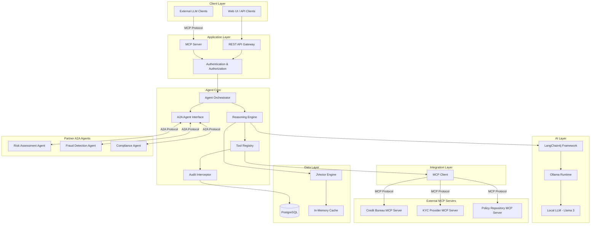
```mermaid
graph TB
    subgraph "Client Layer"
        UI[Web UI / API Clients]
        EXT_LLM[External LLM Clients]
    end

    subgraph "Application Layer"
        API[REST API Gateway]
        AUTH[Authentication & Authorization]
        MCP_SERVER[MCP Server]
    end

    subgraph "Agent Core"
        ORCH[Agent Orchestrator]
        REASON[Reasoning Engine]
        TOOLS[Tool Registry]
        INTERCEPT[Audit Interceptor]
        A2A[A2A Agent Interface]
    end

    subgraph "AI Layer"
        LC4J[LangChain4j Framework]
        OLLAMA[Ollama Runtime]
        LLM[Local LLM - Llama 3]
    end

    subgraph "Integration Layer"
        MCP_CLIENT[MCP Client]
    end

    subgraph "Data Layer"
        JVEC[JVector Engine]
        PG[(PostgreSQL)]
        CACHE[In-Memory Cache]
    end

    subgraph "External MCP Servers"
        CREDIT[Credit Bureau MCP Server]
        KYC[KYC Provider MCP Server]
        POLICY[Policy Repository MCP Server]
    end

    subgraph "Partner A2A Agents"
        RISK_AGENT[Risk Assessment Agent]
        FRAUD_AGENT[Fraud Detection Agent]
        COMPLY_AGENT[Compliance Agent]
    end

    UI --> API
    EXT_LLM -->|MCP Protocol| MCP_SERVER
    API --> AUTH
    MCP_SERVER --> AUTH
    AUTH --> ORCH
    ORCH --> REASON
    REASON --> LC4J
    LC4J --> OLLAMA
    OLLAMA --> LLM
    REASON --> TOOLS
    TOOLS --> INTERCEPT
    INTERCEPT --> PG
    
    ORCH --> A2A
    A2A <-->|A2A Protocol| RISK_AGENT
    A2A <-->|A2A Protocol| FRAUD_AGENT
    A2A <-->|A2A Protocol| COMPLY_AGENT
    
    TOOLS --> MCP_CLIENT
    MCP_CLIENT -->|MCP Protocol| CREDIT
    MCP_CLIENT -->|MCP Protocol| KYC
    MCP_CLIENT -->|MCP Protocol| POLICY
    
    REASON --> JVEC
    JVEC --> CACHE
```

---

## 2. System Design Diagram

### 2.1 Deployment Architecture

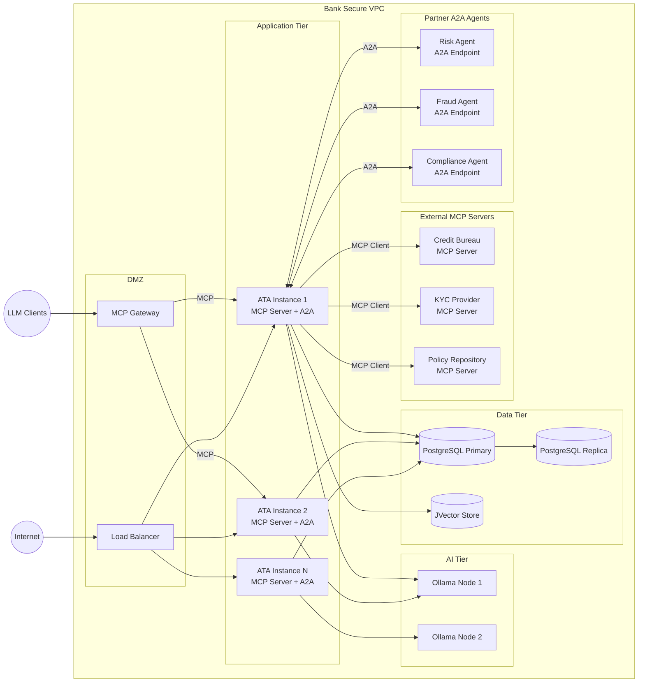
```mermaid
graph LR
    subgraph "Bank Secure VPC"
        subgraph "DMZ"
            LB[Load Balancer]
            MCP_GW[MCP Gateway]
        end

        subgraph "Application Tier"
            ATA1[ATA Instance 1<br/>MCP Server + A2A]
            ATA2[ATA Instance 2<br/>MCP Server + A2A]
            ATA3[ATA Instance N<br/>MCP Server + A2A]
        end

        subgraph "AI Tier"
            OLL1[Ollama Node 1]
            OLL2[Ollama Node 2]
        end

        subgraph "Data Tier"
            PG_PRIMARY[(PostgreSQL Primary)]
            PG_REPLICA[(PostgreSQL Replica)]
            JVEC_STORE[(JVector Store)]
        end

        subgraph "External MCP Servers"
            CREDIT_MCP[Credit Bureau<br/>MCP Server]
            KYC_MCP[KYC Provider<br/>MCP Server]
            POLICY_MCP[Policy Repository<br/>MCP Server]
        end

        subgraph "Partner A2A Agents"
            RISK_A2A[Risk Agent<br/>A2A Endpoint]
            FRAUD_A2A[Fraud Agent<br/>A2A Endpoint]
            COMPLY_A2A[Compliance Agent<br/>A2A Endpoint]
        end
    end

    INTERNET((Internet)) --> LB
    LLM_CLIENTS((LLM Clients)) --> MCP_GW
    MCP_GW -->|MCP| ATA1
    MCP_GW -->|MCP| ATA2
    LB --> ATA1
    LB --> ATA2
    LB --> ATA3
    ATA1 --> OLL1
    ATA2 --> OLL1
    ATA3 --> OLL2
    ATA1 --> PG_PRIMARY
    ATA2 --> PG_PRIMARY
    ATA3 --> PG_PRIMARY
    PG_PRIMARY --> PG_REPLICA
    ATA1 --> JVEC_STORE
    
    ATA1 -->|MCP Client| CREDIT_MCP
    ATA1 -->|MCP Client| KYC_MCP
    ATA1 -->|MCP Client| POLICY_MCP
    
    ATA1 <-->|A2A| RISK_A2A
    ATA1 <-->|A2A| FRAUD_A2A
    ATA1 <-->|A2A| COMPLY_A2A
```

### 2.2 Logical Component Diagram

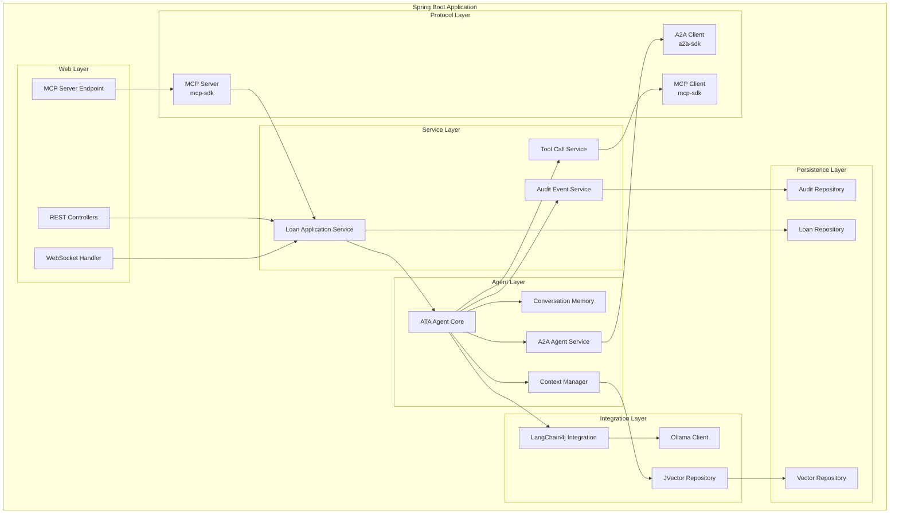
```mermaid
graph TB
    subgraph "Spring Boot Application"
        subgraph "Web Layer"
            REST[REST Controllers]
            WS[WebSocket Handler]
            MCP_EP[MCP Server Endpoint]
        end

        subgraph "Service Layer"
            LAS[Loan Application Service]
            AES[Audit Event Service]
            TCS[Tool Call Service]
        end

        subgraph "Agent Layer"
            AGT[ATA Agent Core]
            MEM[Conversation Memory]
            CTX[Context Manager]
            A2A_SVC[A2A Agent Service]
        end

        subgraph "Protocol Layer"
            MCP_SRV[MCP Server<br/>mcp-sdk]
            MCP_CLI[MCP Client<br/>mcp-sdk]
            A2A_CLI[A2A Client<br/>a2a-sdk]
        end

        subgraph "Integration Layer"
            LC4J_INT[LangChain4j Integration]
            OLLAMA_INT[Ollama Client]
            JVEC_INT[JVector Repository]
        end

        subgraph "Persistence Layer"
            AUDIT_REPO[Audit Repository]
            LOAN_REPO[Loan Repository]
            VECTOR_REPO[Vector Repository]
        end
    end

    REST --> LAS
    WS --> LAS
    MCP_EP --> MCP_SRV
    MCP_SRV --> LAS
    LAS --> AGT
    AGT --> AES
    AGT --> TCS
    AGT --> LC4J_INT
    LC4J_INT --> OLLAMA_INT
    AGT --> MEM
    AGT --> CTX
    CTX --> JVEC_INT
    AES --> AUDIT_REPO
    LAS --> LOAN_REPO
    JVEC_INT --> VECTOR_REPO
    
    AGT --> A2A_SVC
    A2A_SVC --> A2A_CLI
    TCS --> MCP_CLI
```

---

## 3. Component Overview

### 3.1 Core Components

| Component | Description | Technology |
|-----------|-------------|------------|
| **REST API Gateway** | Entry point for all HTTP requests. Handles loan submission, status queries, and audit retrieval. | Spring Web MVC |
| **MCP Server** | Exposes ATA tools and resources via Model Context Protocol for LLM client integration. | mcp-sdk |
| **MCP Client** | Consumes external MCP servers (credit bureau, KYC, policy repositories). | mcp-sdk |
| **A2A Agent Interface** | Enables multi-agent collaboration with Risk, Fraud, and Compliance agents. | a2a-sdk |
| **Agent Orchestrator** | Coordinates the multi-step reasoning process. Manages conversation state and tool invocations. | LangChain4j Agent |
| **Reasoning Engine** | Executes LLM inference with structured prompts. Implements chain-of-thought reasoning for loan decisions. | LangChain4j + Ollama |
| **Tool Registry** | Maintains registry of available tools (Java methods) the agent can invoke deterministically. | Spring Beans |
| **Audit Interceptor** | AOP-based interceptor that captures every tool call and reasoning step before persistence. | Spring AOP |
| **JVector Engine** | Embedded vector database for semantic search over policies and historical decisions. | JVector |
| **Ollama Runtime** | Local LLM inference server running Llama 3 models within the secure VPC. | Ollama |

### 3.2 Supporting Components

| Component | Description | Technology |
|-----------|-------------|------------|
| **Authentication Service** | JWT-based authentication with bank's identity provider integration. | Spring Security |
| **Policy Engine** | Rules engine for loan approval policies and regulatory constraints. | Drools / Custom |
| **Credit Score MCP Server** | External MCP server providing credit bureau data. | mcp-sdk (External) |
| **KYC MCP Server** | External MCP server for customer verification. | mcp-sdk (External) |
| **Risk Assessment Agent** | Partner A2A agent for risk scoring and analysis. | a2a-sdk (External) |
| **Fraud Detection Agent** | Partner A2A agent for fraud pattern detection. | a2a-sdk (External) |
| **Compliance Agent** | Partner A2A agent for regulatory compliance checks. | a2a-sdk (External) |
| **Conversation Memory** | Maintains conversation context for multi-turn interactions. | LangChain4j Memory |

---

## 4. Low-Level Design

### 4.1 Agent Core Class Diagram

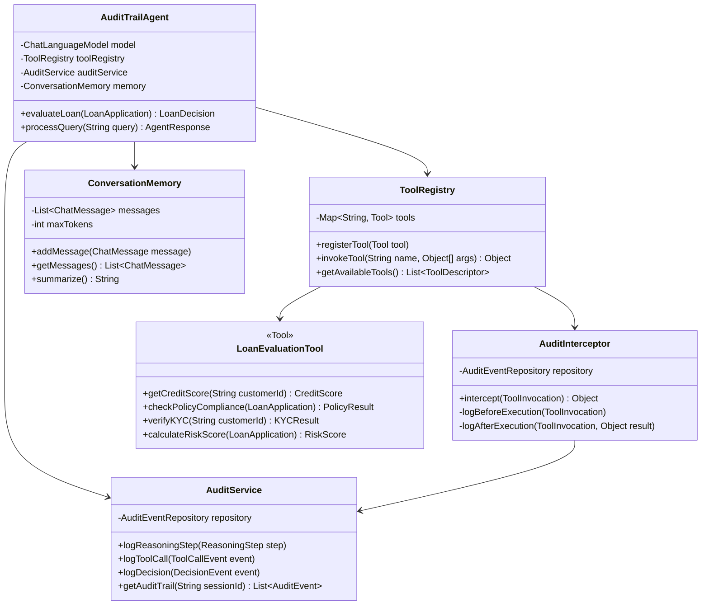
```mermaid
classDiagram
    class AuditTrailAgent {
        -ChatLanguageModel model
        -ToolRegistry toolRegistry
        -AuditService auditService
        -ConversationMemory memory
        +evaluateLoan(LoanApplication) LoanDecision
        +processQuery(String query) AgentResponse
    }

    class ToolRegistry {
        -Map~String, Tool~ tools
        +registerTool(Tool tool)
        +invokeTool(String name, Object[] args) Object
        +getAvailableTools() List~ToolDescriptor~
    }

    class AuditInterceptor {
        -AuditEventRepository repository
        +intercept(ToolInvocation) Object
        -logBeforeExecution(ToolInvocation)
        -logAfterExecution(ToolInvocation, Object result)
    }

    class AuditService {
        -AuditEventRepository repository
        +logReasoningStep(ReasoningStep step)
        +logToolCall(ToolCallEvent event)
        +logDecision(DecisionEvent event)
        +getAuditTrail(String sessionId) List~AuditEvent~
    }

    class LoanEvaluationTool {
        <<Tool>>
        +getCreditScore(String customerId) CreditScore
        +checkPolicyCompliance(LoanApplication) PolicyResult
        +verifyKYC(String customerId) KYCResult
        +calculateRiskScore(LoanApplication) RiskScore
    }

    class ConversationMemory {
        -List~ChatMessage~ messages
        -int maxTokens
        +addMessage(ChatMessage message)
        +getMessages() List~ChatMessage~
        +summarize() String
    }

    AuditTrailAgent --> ToolRegistry
    AuditTrailAgent --> AuditService
    AuditTrailAgent --> ConversationMemory
    ToolRegistry --> AuditInterceptor
    ToolRegistry --> LoanEvaluationTool
    AuditInterceptor --> AuditService
```

### 4.2 Request Processing Flow

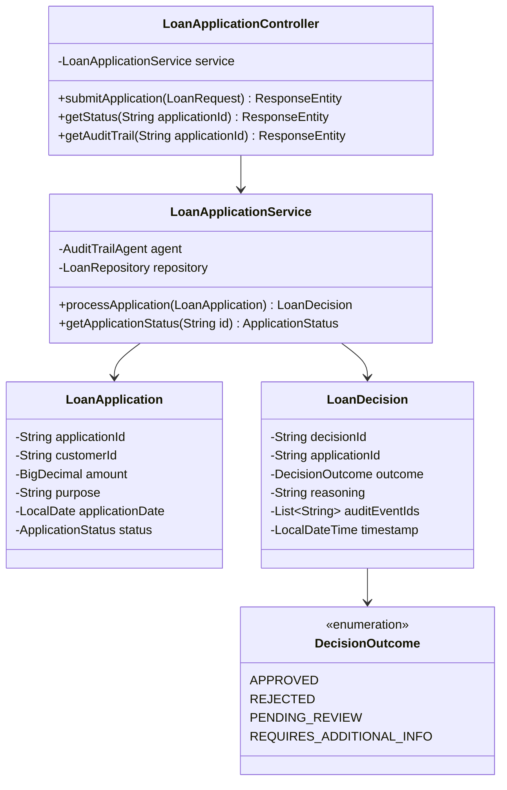
```mermaid
classDiagram
    class LoanApplicationController {
        -LoanApplicationService service
        +submitApplication(LoanRequest) ResponseEntity
        +getStatus(String applicationId) ResponseEntity
        +getAuditTrail(String applicationId) ResponseEntity
    }

    class LoanApplicationService {
        -AuditTrailAgent agent
        -LoanRepository repository
        +processApplication(LoanApplication) LoanDecision
        +getApplicationStatus(String id) ApplicationStatus
    }

    class LoanApplication {
        -String applicationId
        -String customerId
        -BigDecimal amount
        -String purpose
        -LocalDate applicationDate
        -ApplicationStatus status
    }

    class LoanDecision {
        -String decisionId
        -String applicationId
        -DecisionOutcome outcome
        -String reasoning
        -List~String~ auditEventIds
        -LocalDateTime timestamp
    }

    class DecisionOutcome {
        <<enumeration>>
        APPROVED
        REJECTED
        PENDING_REVIEW
        REQUIRES_ADDITIONAL_INFO
    }

    LoanApplicationController --> LoanApplicationService
    LoanApplicationService --> LoanApplication
    LoanApplicationService --> LoanDecision
    LoanDecision --> DecisionOutcome
```

### 4.3 Audit Event Model

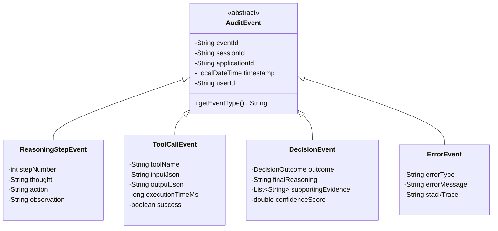
```mermaid
classDiagram
    class AuditEvent {
        <<abstract>>
        -String eventId
        -String sessionId
        -String applicationId
        -LocalDateTime timestamp
        -String userId
        +getEventType() String
    }

    class ReasoningStepEvent {
        -int stepNumber
        -String thought
        -String action
        -String observation
    }

    class ToolCallEvent {
        -String toolName
        -String inputJson
        -String outputJson
        -long executionTimeMs
        -boolean success
    }

    class DecisionEvent {
        -DecisionOutcome outcome
        -String finalReasoning
        -List~String~ supportingEvidence
        -double confidenceScore
    }

    class ErrorEvent {
        -String errorType
        -String errorMessage
        -String stackTrace
    }

    AuditEvent <|-- ReasoningStepEvent
    AuditEvent <|-- ToolCallEvent
    AuditEvent <|-- DecisionEvent
    AuditEvent <|-- ErrorEvent
```

---

## 5. Database Schema

### 5.0 JVector Persistence Strategy

#### How JVector Works

JVector is a **pure-Java embedded vector database** using HNSW (Hierarchical Navigable Small World) graphs for approximate nearest neighbor search.

```
┌─────────────────────────────────────────────────────────────────────────┐
│                        JVECTOR ARCHITECTURE                              │
├─────────────────────────────────────────────────────────────────────────┤
│                                                                         │
│  ┌─────────────────┐    ┌─────────────────┐    ┌─────────────────┐     │
│  │  Embedding      │───▶│  HNSW Graph     │───▶│  Similarity     │     │
│  │  Vectors        │    │  (In-Memory)    │    │  Search         │     │
│  └─────────────────┘    └─────────────────┘    └─────────────────┘     │
│          │                      │                                       │
│          ▼                      ▼                                       │
│  ┌─────────────────────────────────────────────────────────────────┐   │
│  │                    PERSISTENCE LAYER                             │   │
│  │  • GraphIndexBuilder.build() → RandomAccessFile                 │   │
│  │  • OnDiskGraphIndex for memory-mapped file access               │   │
│  │  • Write-Ahead Log (WAL) for durability                         │   │
│  └─────────────────────────────────────────────────────────────────┘   │
│                                                                         │
└─────────────────────────────────────────────────────────────────────────┘
```

#### Durability Concerns & Solutions

| Concern | Risk | Solution |
|---------|------|----------|
| **JVM Crash** | In-memory index lost | Disk persistence + WAL |
| **New embeddings lost** | Vectors added since last save lost | Incremental persistence |
| **Cold start latency** | Reindexing takes time | Memory-mapped files |
| **Concurrent access** | Index corruption | Synchronized updates |

#### Recommended Persistence Architecture

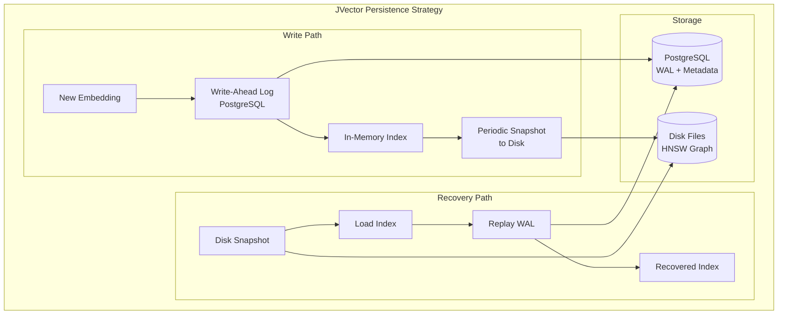
```mermaid
graph TB
    subgraph "JVector Persistence Strategy"
        subgraph "Write Path"
            EMB[New Embedding] --> WAL[Write-Ahead Log<br/>PostgreSQL]
            WAL --> INMEM[In-Memory Index]
            INMEM --> SNAP[Periodic Snapshot<br/>to Disk]
        end
        
        subgraph "Recovery Path"
            DISK[Disk Snapshot] --> LOAD[Load Index]
            LOAD --> REPLAY[Replay WAL]
            REPLAY --> RECOVERED[Recovered Index]
        end
        
        subgraph "Storage"
            PG[(PostgreSQL<br/>WAL + Metadata)]
            FILES[(Disk Files<br/>HNSW Graph)]
        end
    end
    
    WAL --> PG
    SNAP --> FILES
    DISK --> FILES
    REPLAY --> PG
```

#### Implementation Pattern

```java
@Service
public class DurableVectorStore {
    
    private final GraphIndexBuilder<float[]> indexBuilder;
    private final VectorEmbeddingRepository walRepository; // PostgreSQL
    private final Path indexPath = Path.of("/data/jvector/index");
    
    // Write with WAL first, then index
    @Transactional
    public void addEmbedding(String id, float[] vector, Map<String, Object> metadata) {
        // 1. Write to PostgreSQL WAL first (durable)
        VectorEmbedding entity = new VectorEmbedding(id, vector, metadata);
        walRepository.save(entity);
        
        // 2. Add to in-memory index
        indexBuilder.addGraphNode(vectorToNode(entity));
        
        // 3. Mark as indexed
        entity.setIndexed(true);
        walRepository.save(entity);
    }
    
    // Periodic snapshot to disk
    @Scheduled(fixedRate = 300000) // Every 5 minutes
    public void snapshotToDisk() {
        try (var output = new DataOutputStream(
                new BufferedOutputStream(
                    Files.newOutputStream(indexPath)))) {
            OnDiskGraphIndex.write(indexBuilder.getGraph(), output);
            log.info("JVector index snapshot saved");
        }
    }
    
    // Recovery on startup
    @PostConstruct
    public void recover() {
        if (Files.exists(indexPath)) {
            // 1. Load last snapshot
            var onDiskIndex = OnDiskGraphIndex.load(
                ReaderSupplier.open(indexPath));
            indexBuilder.load(onDiskIndex);
            log.info("Loaded JVector snapshot");
            
            // 2. Replay WAL for any unindexed entries
            List<VectorEmbedding> unindexed = 
                walRepository.findByIndexedFalse();
            for (var entry : unindexed) {
                indexBuilder.addGraphNode(vectorToNode(entry));
                entry.setIndexed(true);
                walRepository.save(entry);
            }
            log.info("Replayed {} WAL entries", unindexed.size());
        } else {
            // Cold start: rebuild from WAL
            rebuildFromWal();
        }
    }
    
    // Full rebuild from PostgreSQL (disaster recovery)
    public void rebuildFromWal() {
        log.info("Rebuilding JVector index from WAL...");
        walRepository.findAll().forEach(entity -> {
            indexBuilder.addGraphNode(vectorToNode(entity));
            entity.setIndexed(true);
            walRepository.save(entity);
        });
        snapshotToDisk();
        log.info("JVector index rebuilt");
    }
    
    // Graceful shutdown
    @PreDestroy
    public void shutdown() {
        snapshotToDisk();
        log.info("JVector index saved on shutdown");
    }
}
```

#### JVector Persistence Configuration

```yaml
# application.yml
jvector:
  persistence:
    enabled: true
    index-path: /data/jvector/index
    snapshot-interval-ms: 300000  # 5 minutes
    wal-enabled: true
  index:
    dimensions: 1536  # For text-embedding-3-small
    max-connections: 16
    beam-width: 100
    
spring:
  datasource:
    # PostgreSQL for WAL
    url: jdbc:postgresql://localhost:5432/ata_vectors
```

#### Keeping Embeddings Up-to-Date

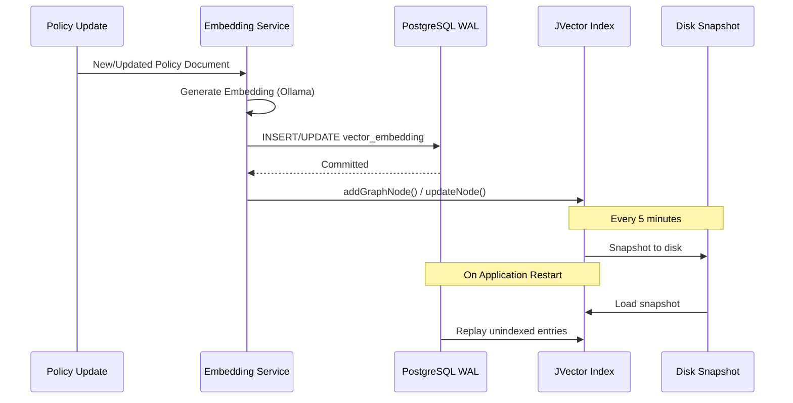
```mermaid
sequenceDiagram
    participant Policy as Policy Update
    participant Embed as Embedding Service
    participant WAL as PostgreSQL WAL
    participant Index as JVector Index
    participant Disk as Disk Snapshot
    
    Policy->>Embed: New/Updated Policy Document
    Embed->>Embed: Generate Embedding (Ollama)
    Embed->>WAL: INSERT/UPDATE vector_embedding
    WAL-->>Embed: Committed
    Embed->>Index: addGraphNode() / updateNode()
    
    Note over Index,Disk: Every 5 minutes
    Index->>Disk: Snapshot to disk
    
    Note over WAL,Index: On Application Restart
    Disk->>Index: Load snapshot
    WAL->>Index: Replay unindexed entries
```

#### Embedding Update Triggers

| Trigger | Action | Implementation |
|---------|--------|----------------|
| **Policy Document Added** | Generate & index embedding | Event listener on document upload |
| **Policy Document Updated** | Re-embed & update index | Version-aware re-indexing |
| **Policy Document Deleted** | Remove from index | Soft delete with reindex |
| **Scheduled Refresh** | Re-embed stale entries | Cron job for embeddings > 30 days |
| **Model Upgrade** | Full re-indexing | Migration job when embedding model changes |

```java
@Component
public class EmbeddingUpdateListener {
    
    @Autowired
    private DurableVectorStore vectorStore;
    
    @Autowired
    private EmbeddingModel embeddingModel; // Ollama
    
    @EventListener
    public void onPolicyUpdated(PolicyDocumentEvent event) {
        PolicyDocument doc = event.getDocument();
        
        // Generate new embedding
        float[] embedding = embeddingModel.embed(doc.getContent());
        
        // Update vector store (WAL + Index)
        vectorStore.addEmbedding(
            doc.getId(),
            embedding,
            Map.of(
                "title", doc.getTitle(),
                "version", doc.getVersion(),
                "updatedAt", Instant.now()
            )
        );
    }
    
    // Scheduled re-indexing for stale embeddings
    @Scheduled(cron = "0 0 2 * * ?") // 2 AM daily
    public void refreshStaleEmbeddings() {
        Instant threshold = Instant.now().minus(30, ChronoUnit.DAYS);
        List<VectorEmbedding> stale = walRepository
            .findByUpdatedAtBefore(threshold);
        
        for (var entry : stale) {
            PolicyDocument doc = policyRepository
                .findById(entry.getSourceId()).orElseThrow();
            float[] newEmbedding = embeddingModel.embed(doc.getContent());
            vectorStore.addEmbedding(entry.getId(), newEmbedding, 
                entry.getMetadata());
        }
    }
}
```

### 5.1 Entity Relationship Diagram

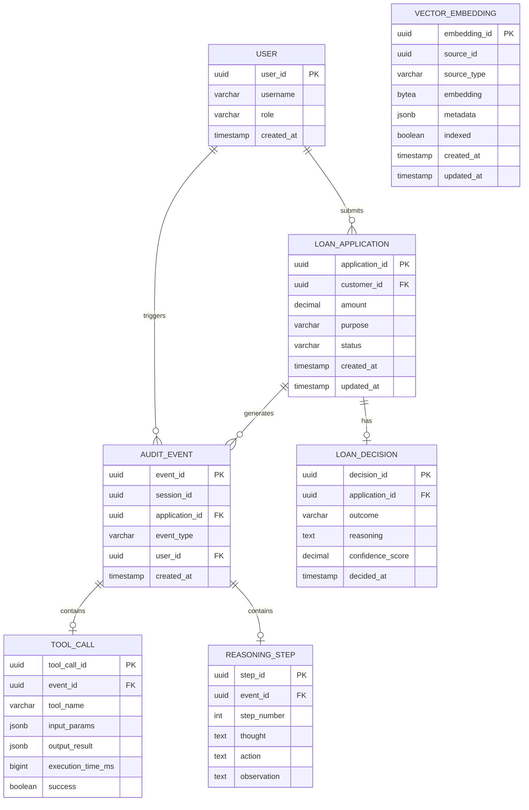
```mermaid
erDiagram
    LOAN_APPLICATION ||--o{ AUDIT_EVENT : generates
    LOAN_APPLICATION ||--o| LOAN_DECISION : has
    AUDIT_EVENT ||--o| TOOL_CALL : contains
    AUDIT_EVENT ||--o| REASONING_STEP : contains
    USER ||--o{ LOAN_APPLICATION : submits
    USER ||--o{ AUDIT_EVENT : triggers

    LOAN_APPLICATION {
        uuid application_id PK
        uuid customer_id FK
        decimal amount
        varchar purpose
        varchar status
        timestamp created_at
        timestamp updated_at
    }

    LOAN_DECISION {
        uuid decision_id PK
        uuid application_id FK
        varchar outcome
        text reasoning
        decimal confidence_score
        timestamp decided_at
    }

    AUDIT_EVENT {
        uuid event_id PK
        uuid session_id
        uuid application_id FK
        varchar event_type
        uuid user_id FK
        timestamp created_at
    }

    TOOL_CALL {
        uuid tool_call_id PK
        uuid event_id FK
        varchar tool_name
        jsonb input_params
        jsonb output_result
        bigint execution_time_ms
        boolean success
    }

    REASONING_STEP {
        uuid step_id PK
        uuid event_id FK
        int step_number
        text thought
        text action
        text observation
    }

    USER {
        uuid user_id PK
        varchar username
        varchar role
        timestamp created_at
    }

    VECTOR_EMBEDDING {
        uuid embedding_id PK
        uuid source_id
        varchar source_type
        bytea embedding
        jsonb metadata
        boolean indexed
        timestamp created_at
        timestamp updated_at
    }
```

### 5.2 Table Definitions

#### `vector_embedding` (WAL for JVector)
```sql
CREATE TABLE vector_embedding (
    embedding_id UUID PRIMARY KEY DEFAULT gen_random_uuid(),
    source_id UUID NOT NULL,
    source_type VARCHAR(50) NOT NULL,  -- 'POLICY', 'DECISION', 'APPLICATION'
    embedding BYTEA NOT NULL,           -- Serialized float[] vector
    dimensions INTEGER NOT NULL,
    metadata JSONB,
    indexed BOOLEAN NOT NULL DEFAULT FALSE,  -- WAL replay marker
    created_at TIMESTAMP WITH TIME ZONE DEFAULT CURRENT_TIMESTAMP,
    updated_at TIMESTAMP WITH TIME ZONE DEFAULT CURRENT_TIMESTAMP
);

CREATE INDEX idx_vector_source ON vector_embedding(source_id, source_type);
CREATE INDEX idx_vector_unindexed ON vector_embedding(indexed) WHERE indexed = FALSE;
CREATE INDEX idx_vector_updated ON vector_embedding(updated_at);
```

#### `loan_application`
```sql
CREATE TABLE loan_application (
    application_id UUID PRIMARY KEY DEFAULT gen_random_uuid(),
    customer_id UUID NOT NULL,
    amount DECIMAL(15, 2) NOT NULL,
    purpose VARCHAR(500),
    status VARCHAR(50) NOT NULL DEFAULT 'PENDING',
    created_at TIMESTAMP WITH TIME ZONE DEFAULT CURRENT_TIMESTAMP,
    updated_at TIMESTAMP WITH TIME ZONE DEFAULT CURRENT_TIMESTAMP
);

CREATE INDEX idx_loan_app_customer ON loan_application(customer_id);
CREATE INDEX idx_loan_app_status ON loan_application(status);
```

#### `audit_event`
```sql
CREATE TABLE audit_event (
    event_id UUID PRIMARY KEY DEFAULT gen_random_uuid(),
    session_id UUID NOT NULL,
    application_id UUID REFERENCES loan_application(application_id),
    event_type VARCHAR(50) NOT NULL,
    user_id UUID,
    created_at TIMESTAMP WITH TIME ZONE DEFAULT CURRENT_TIMESTAMP
);

CREATE INDEX idx_audit_session ON audit_event(session_id);
CREATE INDEX idx_audit_application ON audit_event(application_id);
CREATE INDEX idx_audit_created ON audit_event(created_at);
```

#### `tool_call`
```sql
CREATE TABLE tool_call (
    tool_call_id UUID PRIMARY KEY DEFAULT gen_random_uuid(),
    event_id UUID NOT NULL REFERENCES audit_event(event_id),
    tool_name VARCHAR(100) NOT NULL,
    input_params JSONB,
    output_result JSONB,
    execution_time_ms BIGINT,
    success BOOLEAN NOT NULL DEFAULT TRUE
);

CREATE INDEX idx_tool_call_event ON tool_call(event_id);
CREATE INDEX idx_tool_call_name ON tool_call(tool_name);
```

#### `reasoning_step`
```sql
CREATE TABLE reasoning_step (
    step_id UUID PRIMARY KEY DEFAULT gen_random_uuid(),
    event_id UUID NOT NULL REFERENCES audit_event(event_id),
    step_number INTEGER NOT NULL,
    thought TEXT,
    action TEXT,
    observation TEXT
);

CREATE INDEX idx_reasoning_event ON reasoning_step(event_id);
```

---

## 6. Sequence Diagrams

### 6.1 Loan Application Evaluation Flow

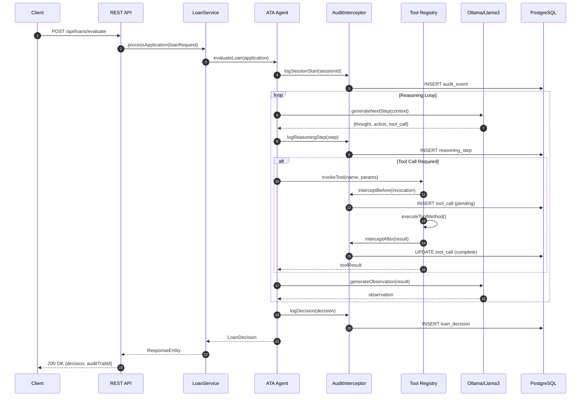
```mermaid
sequenceDiagram
    autonumber
    participant Client
    participant API as REST API
    participant Service as LoanService
    participant Agent as ATA Agent
    participant Audit as AuditInterceptor
    participant Tools as Tool Registry
    participant LLM as Ollama/Llama3
    participant DB as PostgreSQL

    Client->>API: POST /api/loans/evaluate
    API->>Service: processApplication(loanRequest)
    Service->>Agent: evaluateLoan(application)
    
    Agent->>Audit: logSessionStart(sessionId)
    Audit->>DB: INSERT audit_event
    
    loop Reasoning Loop
        Agent->>LLM: generateNextStep(context)
        LLM-->>Agent: {thought, action, tool_call}
        
        Agent->>Audit: logReasoningStep(step)
        Audit->>DB: INSERT reasoning_step
        
        alt Tool Call Required
            Agent->>Tools: invokeTool(name, params)
            Tools->>Audit: interceptBefore(invocation)
            Audit->>DB: INSERT tool_call (pending)
            
            Tools->>Tools: executeToolMethod()
            
            Tools->>Audit: interceptAfter(result)
            Audit->>DB: UPDATE tool_call (complete)
            Tools-->>Agent: toolResult
        end
        
        Agent->>LLM: generateObservation(result)
        LLM-->>Agent: observation
    end
    
    Agent->>Audit: logDecision(decision)
    Audit->>DB: INSERT loan_decision
    
    Agent-->>Service: LoanDecision
    Service-->>API: ResponseEntity
    API-->>Client: 200 OK {decision, auditTrailId}
```

### 6.2 Audit Trail Retrieval Flow

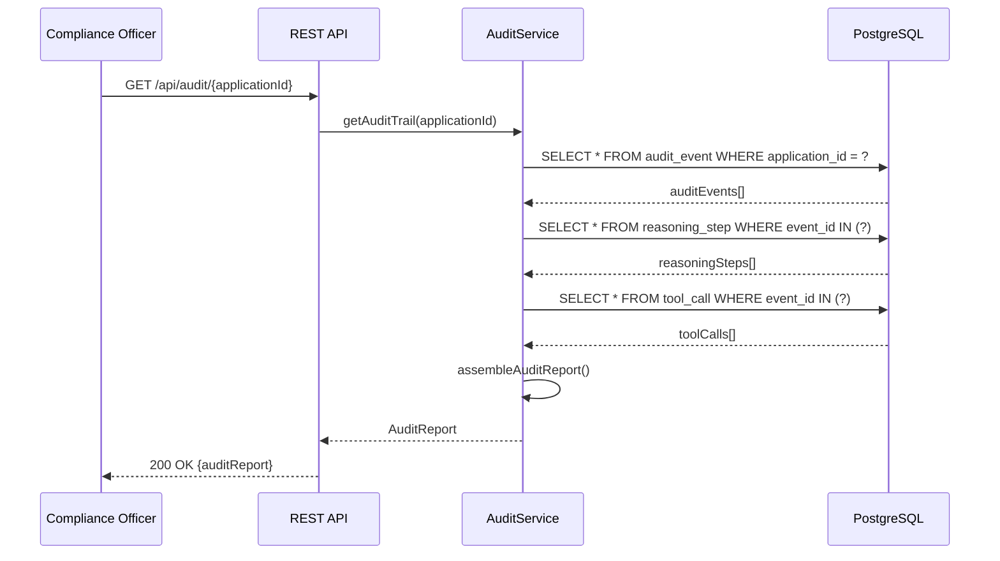
```mermaid
sequenceDiagram
    participant Compliance as Compliance Officer
    participant API as REST API
    participant Service as AuditService
    participant DB as PostgreSQL

    Compliance->>API: GET /api/audit/{applicationId}
    API->>Service: getAuditTrail(applicationId)
    
    Service->>DB: SELECT * FROM audit_event WHERE application_id = ?
    DB-->>Service: auditEvents[]
    
    Service->>DB: SELECT * FROM reasoning_step WHERE event_id IN (?)
    DB-->>Service: reasoningSteps[]
    
    Service->>DB: SELECT * FROM tool_call WHERE event_id IN (?)
    DB-->>Service: toolCalls[]
    
    Service->>Service: assembleAuditReport()
    Service-->>API: AuditReport
    API-->>Compliance: 200 OK {auditReport}
```

---

## 7. Data Flow

### 7.1 Complete Data Flow Diagram

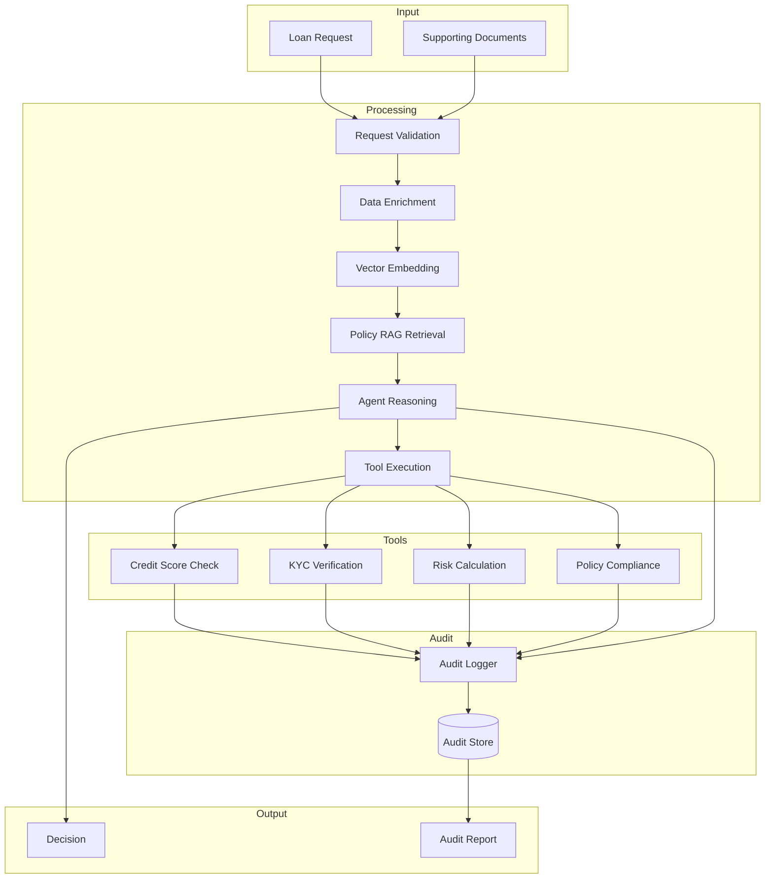
```mermaid
flowchart TD
    subgraph Input
        REQ[Loan Request]
        DOC[Supporting Documents]
    end

    subgraph Processing
        VAL[Request Validation]
        ENR[Data Enrichment]
        VEC[Vector Embedding]
        RAG[Policy RAG Retrieval]
        REASON[Agent Reasoning]
        TOOL[Tool Execution]
    end

    subgraph Tools
        CS[Credit Score Check]
        KYC[KYC Verification]
        RISK[Risk Calculation]
        POLICY[Policy Compliance]
    end

    subgraph Audit
        LOG[Audit Logger]
        STORE[(Audit Store)]
    end

    subgraph Output
        DEC[Decision]
        REPORT[Audit Report]
    end

    REQ --> VAL
    DOC --> VAL
    VAL --> ENR
    ENR --> VEC
    VEC --> RAG
    RAG --> REASON
    
    REASON --> TOOL
    TOOL --> CS
    TOOL --> KYC
    TOOL --> RISK
    TOOL --> POLICY
    
    CS --> LOG
    KYC --> LOG
    RISK --> LOG
    POLICY --> LOG
    REASON --> LOG
    
    LOG --> STORE
    
    REASON --> DEC
    STORE --> REPORT
```

### 7.2 Security Boundaries

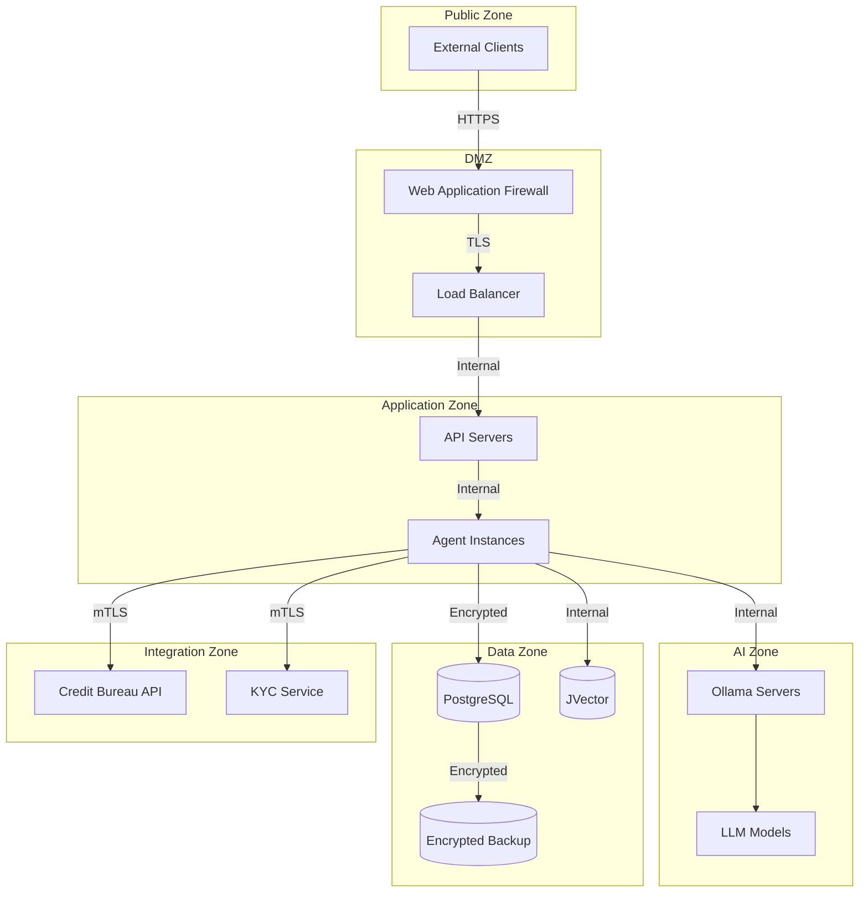
```mermaid
flowchart TB
    subgraph "Public Zone"
        EXT[External Clients]
    end

    subgraph "DMZ"
        WAF[Web Application Firewall]
        LB[Load Balancer]
    end

    subgraph "Application Zone"
        API[API Servers]
        AGENT[Agent Instances]
    end

    subgraph "AI Zone"
        OLLAMA[Ollama Servers]
        MODELS[LLM Models]
    end

    subgraph "Data Zone"
        DB[(PostgreSQL)]
        JVEC[(JVector)]
        BACKUP[(Encrypted Backup)]
    end

    subgraph "Integration Zone"
        CREDIT[Credit Bureau API]
        KYC[KYC Service]
    end

    EXT -->|HTTPS| WAF
    WAF -->|TLS| LB
    LB -->|Internal| API
    API -->|Internal| AGENT
    AGENT -->|Internal| OLLAMA
    OLLAMA --> MODELS
    AGENT -->|Encrypted| DB
    AGENT -->|Internal| JVEC
    DB -->|Encrypted| BACKUP
    AGENT -->|mTLS| CREDIT
    AGENT -->|mTLS| KYC
```

---

## 8. MCP and A2A Integration

### 8.1 Protocol Overview

The ATA can leverage both **MCP (Model Context Protocol)** and **A2A (Agent-to-Agent Protocol)** for enhanced interoperability and multi-agent collaboration.

| Protocol | Purpose | ATA Role |
|----------|---------|----------|
| **MCP (Model Context Protocol)** | Standardized tool/resource access for LLMs | Both Server & Client |
| **A2A (Agent-to-Agent Protocol)** | Inter-agent communication & task delegation | Participant Agent |

### 8.2 MCP Architecture

#### Should We Use MCP? ✅ YES

**Benefits for ATA:**
- 🔌 **Standardized Tool Interface**: Expose loan evaluation tools via MCP for any LLM client
- 🔗 **External Data Sources**: Connect to credit bureaus, KYC providers as MCP servers
- 🛡️ **Security**: MCP's capability-based security aligns with banking requirements
- 📦 **Composability**: Mix and match tools from different MCP servers

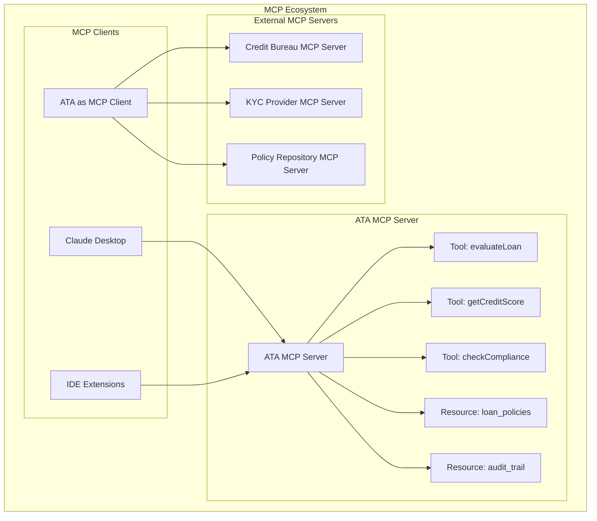
```mermaid
graph TB
    subgraph "MCP Ecosystem"
        subgraph "MCP Clients"
            CLAUDE[Claude Desktop]
            IDE[IDE Extensions]
            ATA_CLIENT[ATA as MCP Client]
        end

        subgraph "ATA MCP Server"
            MCP_ATA[ATA MCP Server]
            TOOL1[Tool: evaluateLoan]
            TOOL2[Tool: getCreditScore]
            TOOL3[Tool: checkCompliance]
            RES1[Resource: loan_policies]
            RES2[Resource: audit_trail]
        end

        subgraph "External MCP Servers"
            MCP_CREDIT[Credit Bureau MCP Server]
            MCP_KYC[KYC Provider MCP Server]
            MCP_POLICY[Policy Repository MCP Server]
        end
    end

    CLAUDE --> MCP_ATA
    IDE --> MCP_ATA
    MCP_ATA --> TOOL1
    MCP_ATA --> TOOL2
    MCP_ATA --> TOOL3
    MCP_ATA --> RES1
    MCP_ATA --> RES2
    
    ATA_CLIENT --> MCP_CREDIT
    ATA_CLIENT --> MCP_KYC
    ATA_CLIENT --> MCP_POLICY
```

#### MCP Server Implementation

The ATA exposes these capabilities via MCP:

```
┌─────────────────────────────────────────────────────────────────────────┐
│                        ATA MCP SERVER CAPABILITIES                       │
├─────────────────────────────────────────────────────────────────────────┤
│                                                                         │
│  TOOLS (Executable Functions)                                           │
│  ├── evaluate_loan(application_data) → LoanDecision                    │
│  ├── get_credit_score(customer_id) → CreditScore                       │
│  ├── verify_kyc(customer_id) → KYCResult                               │
│  ├── check_policy_compliance(loan_params) → ComplianceResult           │
│  └── get_audit_trail(application_id) → AuditReport                     │
│                                                                         │
│  RESOURCES (Data Access)                                                │
│  ├── loan://policies/{policy_id} → Policy document                     │
│  ├── loan://applications/{app_id} → Application details                │
│  ├── audit://trail/{session_id} → Audit events                         │
│  └── audit://decisions/{decision_id} → Decision reasoning              │
│                                                                         │
│  PROMPTS (Reusable Templates)                                           │
│  ├── loan_evaluation_prompt → Structured evaluation template           │
│  └── compliance_check_prompt → Regulatory compliance template          │
│                                                                         │
└─────────────────────────────────────────────────────────────────────────┘
```

#### MCP Server Code Structure

```java
// MCP Server Configuration
@Configuration
public class McpServerConfig {
    
    @Bean
    public McpServer mcpServer(LoanToolProvider tools, 
                                ResourceProvider resources) {
        return McpServer.builder()
            .name("audit-trail-agent")
            .version("1.0.0")
            .capabilities(Capabilities.builder()
                .tools(true)
                .resources(true)
                .prompts(true)
                .build())
            .toolProvider(tools)
            .resourceProvider(resources)
            .build();
    }
}

// MCP Tool Definition
@McpTool(name = "evaluate_loan", 
         description = "Evaluate a loan application with full audit trail")
public class EvaluateLoanTool {
    
    @ToolMethod
    public LoanDecision execute(
        @Param("customer_id") String customerId,
        @Param("amount") BigDecimal amount,
        @Param("purpose") String purpose
    ) {
        // Delegates to AuditTrailAgent
        return auditTrailAgent.evaluateLoan(
            new LoanApplication(customerId, amount, purpose)
        );
    }
}
```

### 8.3 A2A Architecture

#### Should We Use A2A? ✅ YES (for Multi-Agent Scenarios)

**When to use A2A:**
- Complex loan evaluations requiring specialist agents
- Distributed decision-making across departments
- Escalation workflows to human-assisted agents

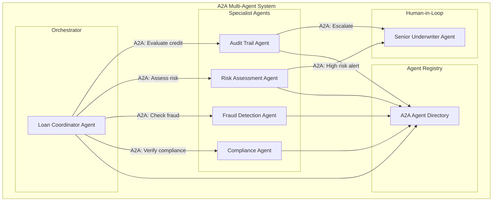
```mermaid
graph TB
    subgraph "A2A Multi-Agent System"
        subgraph "Orchestrator"
            COORD[Loan Coordinator Agent]
        end

        subgraph "Specialist Agents"
            ATA[Audit Trail Agent]
            RISK[Risk Assessment Agent]
            FRAUD[Fraud Detection Agent]
            COMPLY[Compliance Agent]
        end

        subgraph "Human-in-Loop"
            REVIEW[Senior Underwriter Agent]
        end

        subgraph "Agent Registry"
            REG[A2A Agent Directory]
        end
    end

    COORD -->|"A2A: Evaluate credit"| ATA
    COORD -->|"A2A: Assess risk"| RISK
    COORD -->|"A2A: Check fraud"| FRAUD
    COORD -->|"A2A: Verify compliance"| COMPLY
    
    ATA -->|"A2A: Escalate"| REVIEW
    RISK -->|"A2A: High risk alert"| REVIEW
    
    COORD --> REG
    ATA --> REG
    RISK --> REG
    FRAUD --> REG
    COMPLY --> REG
```

#### A2A Agent Card for ATA

```json
{
  "name": "Audit Trail Agent",
  "description": "Bank-grade loan evaluation agent with immutable audit trail",
  "url": "https://internal.bank.com/agents/ata",
  "version": "1.0.0",
  "capabilities": {
    "streaming": true,
    "pushNotifications": true,
    "stateTransitionHistory": true
  },
  "skills": [
    {
      "id": "loan-evaluation",
      "name": "Loan Application Evaluation",
      "description": "Evaluates loan applications with full reasoning transparency",
      "inputModes": ["text", "structured"],
      "outputModes": ["text", "structured"]
    },
    {
      "id": "audit-retrieval",
      "name": "Audit Trail Retrieval", 
      "description": "Retrieves complete audit trail for any decision",
      "inputModes": ["structured"],
      "outputModes": ["structured"]
    }
  ],
  "authentication": {
    "schemes": ["oauth2", "mtls"]
  },
  "compliance": {
    "certifications": ["SOC2", "ISO27001"],
    "dataResidency": "on-premise"
  }
}
```

#### A2A Communication Flow

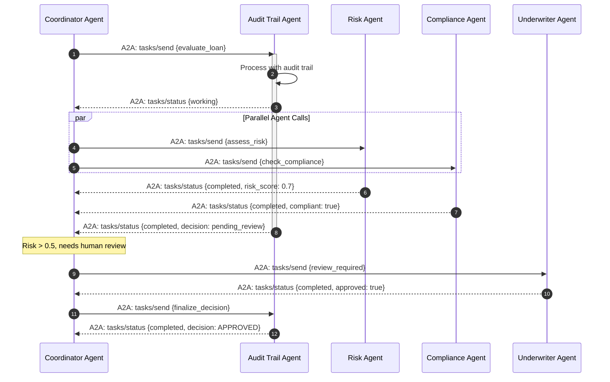
```mermaid
sequenceDiagram
    autonumber
    participant Coord as Coordinator Agent
    participant ATA as Audit Trail Agent
    participant Risk as Risk Agent
    participant Comply as Compliance Agent
    participant Human as Underwriter Agent

    Coord->>ATA: A2A: tasks/send {evaluate_loan}
    activate ATA
    ATA->>ATA: Process with audit trail
    ATA-->>Coord: A2A: tasks/status {working}
    
    par Parallel Agent Calls
        Coord->>Risk: A2A: tasks/send {assess_risk}
        Coord->>Comply: A2A: tasks/send {check_compliance}
    end
    
    Risk-->>Coord: A2A: tasks/status {completed, risk_score: 0.7}
    Comply-->>Coord: A2A: tasks/status {completed, compliant: true}
    ATA-->>Coord: A2A: tasks/status {completed, decision: pending_review}
    deactivate ATA
    
    Note over Coord: Risk > 0.5, needs human review
    
    Coord->>Human: A2A: tasks/send {review_required}
    Human-->>Coord: A2A: tasks/status {completed, approved: true}
    
    Coord->>ATA: A2A: tasks/send {finalize_decision}
    ATA-->>Coord: A2A: tasks/status {completed, decision: APPROVED}
```

### 8.4 Combined MCP + A2A Architecture

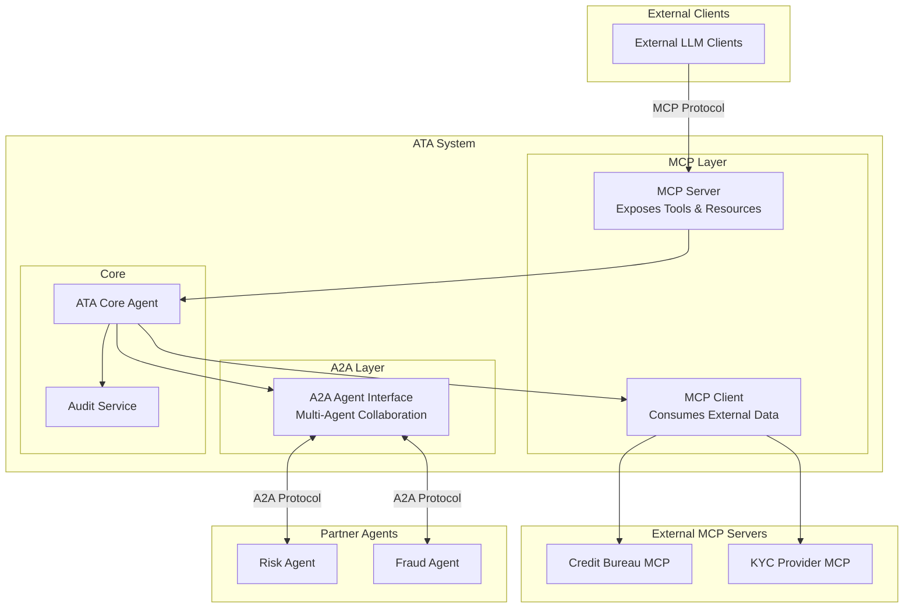
```mermaid
graph TB
    subgraph "External Clients"
        EXT_LLM[External LLM Clients]
    end

    subgraph "ATA System"
        subgraph "MCP Layer"
            MCP_SERVER[MCP Server<br/>Exposes Tools & Resources]
            MCP_CLIENT[MCP Client<br/>Consumes External Data]
        end

        subgraph "A2A Layer"
            A2A_AGENT[A2A Agent Interface<br/>Multi-Agent Collaboration]
        end

        subgraph "Core"
            AGENT[ATA Core Agent]
            AUDIT[Audit Service]
        end
    end

    subgraph "External MCP Servers"
        CREDIT_MCP[Credit Bureau MCP]
        KYC_MCP[KYC Provider MCP]
    end

    subgraph "Partner Agents"
        RISK_AGENT[Risk Agent]
        FRAUD_AGENT[Fraud Agent]
    end

    EXT_LLM -->|MCP Protocol| MCP_SERVER
    MCP_SERVER --> AGENT
    MCP_CLIENT --> CREDIT_MCP
    MCP_CLIENT --> KYC_MCP
    AGENT --> MCP_CLIENT
    
    A2A_AGENT <-->|A2A Protocol| RISK_AGENT
    A2A_AGENT <-->|A2A Protocol| FRAUD_AGENT
    AGENT --> A2A_AGENT
    
    AGENT --> AUDIT
```

### 8.5 Implementation Recommendations

| Component | Recommendation | Priority |
|-----------|---------------|----------|
| **MCP Server** | ✅ Implement | **High** - Enables tool reuse across LLM clients |
| **MCP Client** | ✅ Implement | **High** - Standardizes external data access |
| **A2A Protocol** | ✅ Implement | **Medium** - Needed for multi-agent scenarios |
| **A2A Agent Registry** | ✅ Implement | **Medium** - Service discovery for agents |

### 8.6 Technology Choices

| Protocol | Java Library | Notes |
|----------|--------------|-------|
| **MCP** | `mcp-java-sdk` | Official MCP SDK for Java |
| **A2A** | `a2a-java-client` | Google's A2A reference implementation |
| **Transport** | HTTP/SSE or WebSocket | MCP supports both; A2A uses HTTP |

### 8.7 Security Considerations

```
┌─────────────────────────────────────────────────────────────────────────┐
│                    MCP & A2A SECURITY ARCHITECTURE                      │
├─────────────────────────────────────────────────────────────────────────┤
│                                                                         │
│  MCP Security                          A2A Security                     │
│  ─────────────                         ────────────                     │
│  • Capability-based access             • Agent authentication (mTLS)   │
│  • Tool-level permissions              • Agent Card verification       │
│  • Resource scoping                    • Task-level authorization      │
│  • Audit logging of all calls          • End-to-end encryption         │
│                                                                         │
│  Shared Security Layer                                                  │
│  ────────────────────                                                   │
│  • All communications within bank VPC                                   │
│  • No external network exposure                                         │
│  • Every interaction logged to audit trail                              │
│  • OAuth2/mTLS for all inter-service calls                              │
│                                                                         │
└─────────────────────────────────────────────────────────────────────────┘
```

---

## Appendix A: Technology Decisions

| Decision | Choice | Rationale |
|----------|--------|-----------|
| **Java Version** | Java 25 | Latest LTS with Virtual Threads (Project Loom) for high concurrency |
| **AI Framework** | LangChain4j | Native Java support, tool calling, and memory management |
| **MCP SDK** | mcp-sdk (Java) | Model Context Protocol for tool/resource exposure and consumption |
| **A2A SDK** | a2a-sdk (Java) | Agent-to-Agent Protocol for multi-agent collaboration |
| **LLM Runtime (Dev)** | Ollama | Easy local development, model management |
| **LLM Runtime (Prod)** | vLLM / TGI | Enterprise throughput, GPU optimization, HA |
| **Vector DB** | JVector | Pure Java, embedded, no external dependencies |
| **Primary DB** | PostgreSQL | ACID compliance, JSONB support, enterprise-grade |
| **Web Framework** | Spring Boot 3.x | Industry standard, excellent security features |

### LLM Runtime Strategy: Ollama vs Production Alternatives

#### Why Ollama Alone Is NOT Sufficient for Production

```
┌─────────────────────────────────────────────────────────────────────────┐
│                    OLLAMA ENTERPRISE LIMITATIONS                        │
├─────────────────────────────────────────────────────────────────────────┤
│                                                                         │
│  ❌ Single-Node Architecture                                            │
│     • No built-in clustering or replication                            │
│     • Single point of failure                                          │
│                                                                         │
│  ❌ Limited Throughput                                                  │
│     • Sequential request processing                                    │
│     • No continuous batching                                           │
│     • ~10-50 requests/sec (vs 500+ needed)                             │
│                                                                         │
│  ❌ No Enterprise Features                                              │
│     • No SLA or support contracts                                      │
│     • Basic monitoring only                                            │
│     • No auto-scaling                                                  │
│                                                                         │
│  ❌ GPU Utilization                                                     │
│     • No tensor parallelism                                            │
│     • No PagedAttention (memory inefficient)                           │
│                                                                         │
│  ✅ GOOD FOR: Development, testing, PoC                                │
│  ❌ NOT FOR: Production bank workloads                                 │
│                                                                         │
└─────────────────────────────────────────────────────────────────────────┘
```

#### Recommended Production Architecture

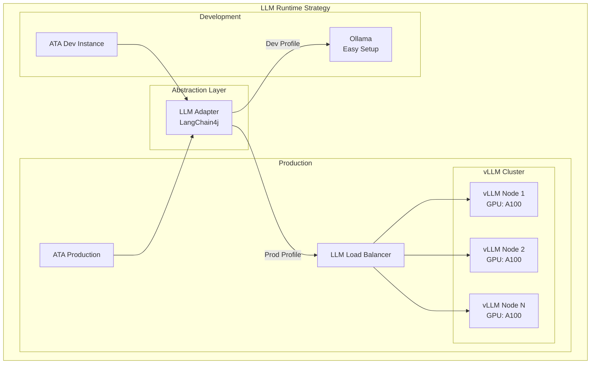
```mermaid
graph TB
    subgraph "LLM Runtime Strategy"
        subgraph "Development"
            DEV_APP[ATA Dev Instance]
            OLLAMA[Ollama<br/>Easy Setup]
        end
        
        subgraph "Production"
            PROD_APP[ATA Production]
            LB_LLM[LLM Load Balancer]
            
            subgraph "vLLM Cluster"
                VLLM1[vLLM Node 1<br/>GPU: A100]
                VLLM2[vLLM Node 2<br/>GPU: A100]
                VLLM3[vLLM Node N<br/>GPU: A100]
            end
        end
        
        subgraph "Abstraction Layer"
            ADAPTER[LLM Adapter<br/>LangChain4j]
        end
    end
    
    DEV_APP --> ADAPTER
    PROD_APP --> ADAPTER
    ADAPTER -->|Dev Profile| OLLAMA
    ADAPTER -->|Prod Profile| LB_LLM
    LB_LLM --> VLLM1
    LB_LLM --> VLLM2
    LB_LLM --> VLLM3
```

#### Production LLM Options Comparison

| Feature | Ollama | vLLM | TGI | Triton |
|---------|--------|------|-----|--------|
| **Throughput** | ~50 req/s | ~500+ req/s | ~400+ req/s | ~600+ req/s |
| **Continuous Batching** | ❌ | ✅ | ✅ | ✅ |
| **PagedAttention** | ❌ | ✅ | ✅ | ✅ |
| **Tensor Parallelism** | ❌ | ✅ | ✅ | ✅ |
| **OpenAI-Compatible API** | ✅ | ✅ | ✅ | ❌ |
| **Multi-GPU** | Limited | ✅ | ✅ | ✅ |
| **Quantization** | ✅ | ✅ | ✅ | ✅ |
| **K8s Native** | ❌ | ✅ | ✅ | ✅ |
| **Setup Complexity** | Easy | Medium | Medium | High |
| **Bank Production Ready** | ❌ | ✅ | ✅ | ✅ |

#### Recommended: vLLM for Production

**Why vLLM:**
- PagedAttention: 24x throughput improvement
- OpenAI-compatible API (easy migration from Ollama)
- Continuous batching for high concurrency
- Kubernetes-native deployment
- Active development & enterprise adoption

#### What is vLLM? (Deep Dive)

```
┌─────────────────────────────────────────────────────────────────────────┐
│                        vLLM EXPLAINED                                   │
├─────────────────────────────────────────────────────────────────────────┤
│                                                                         │
│  vLLM = High-Performance LLM INFERENCE SERVER                          │
│                                                                         │
│  ✅ Runs models LOCALLY on your own GPUs (on-premise)                  │
│  ✅ No data leaves your network                                        │
│  ✅ You download the model weights once                                │
│  ✅ OpenAI-compatible REST API                                         │
│                                                                         │
│  COMPONENTS OF A vLLM INSTANCE:                                        │
│  ┌─────────────────────────────────────────────────────────────────┐   │
│  │  vLLM Server Process                                            │   │
│  │  ├── Model Weights (Llama 3 70B = ~140GB on disk)              │   │
│  │  ├── GPU Memory (loaded model = ~140GB VRAM)                   │   │
│  │  ├── PagedAttention Engine (efficient KV cache)                │   │
│  │  ├── Continuous Batching Scheduler                             │   │
│  │  ├── OpenAI-Compatible API Server (port 8000)                  │   │
│  │  └── Tensor Parallel Workers (multi-GPU coordination)          │   │
│  └─────────────────────────────────────────────────────────────────┘   │
│                                                                         │
└─────────────────────────────────────────────────────────────────────────┘
```

#### vLLM Cluster Architecture

A "vLLM Cluster" = Multiple vLLM server instances for high availability

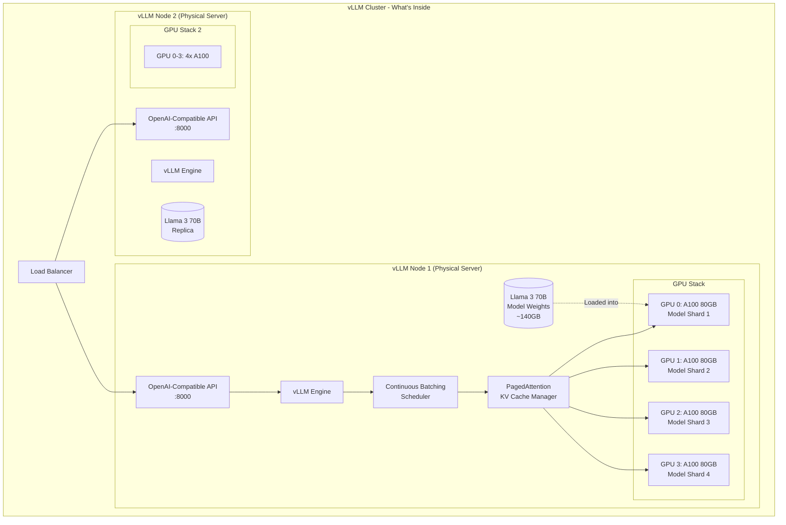
```mermaid
graph TB
    subgraph "vLLM Cluster - What's Inside"
        subgraph "vLLM Node 1 (Physical Server)"
            API1[OpenAI-Compatible API<br/>:8000]
            ENGINE1[vLLM Engine]
            SCHED1[Continuous Batching<br/>Scheduler]
            PAGE1[PagedAttention<br/>KV Cache Manager]
            
            subgraph "GPU Stack"
                GPU1A[GPU 0: A100 80GB<br/>Model Shard 1]
                GPU1B[GPU 1: A100 80GB<br/>Model Shard 2]
                GPU1C[GPU 2: A100 80GB<br/>Model Shard 3]
                GPU1D[GPU 3: A100 80GB<br/>Model Shard 4]
            end
            
            MODEL1[(Llama 3 70B<br/>Model Weights<br/>~140GB)]
        end
        
        subgraph "vLLM Node 2 (Physical Server)"
            API2[OpenAI-Compatible API<br/>:8000]
            ENGINE2[vLLM Engine]
            
            subgraph "GPU Stack 2"
                GPU2A[GPU 0-3: 4x A100]
            end
            
            MODEL2[(Llama 3 70B<br/>Replica)]
        end
        
        LB[Load Balancer]
    end
    
    LB --> API1
    LB --> API2
    API1 --> ENGINE1
    ENGINE1 --> SCHED1
    SCHED1 --> PAGE1
    PAGE1 --> GPU1A
    PAGE1 --> GPU1B
    PAGE1 --> GPU1C
    PAGE1 --> GPU1D
    MODEL1 -.->|Loaded into| GPU1A
```

#### How vLLM Runs Locally (Step by Step)

```
┌─────────────────────────────────────────────────────────────────────────┐
│                    vLLM LOCAL DEPLOYMENT FLOW                           │
├─────────────────────────────────────────────────────────────────────────┤
│                                                                         │
│  STEP 1: Download Model (One Time)                                     │
│  ────────────────────────────────                                      │
│  $ huggingface-cli download meta-llama/Llama-3-70B-Instruct            │
│  # Downloads ~140GB to local disk                                      │
│  # Stored in: /models/llama-3-70b/                                     │
│                                                                         │
│  STEP 2: Start vLLM Server                                             │
│  ─────────────────────────────                                         │
│  $ python -m vllm.entrypoints.openai.api_server \                      │
│      --model /models/llama-3-70b \                                     │
│      --tensor-parallel-size 4 \                                        │
│      --port 8000                                                        │
│                                                                         │
│  STEP 3: Model Loads into GPU Memory                                   │
│  ────────────────────────────────────                                  │
│  # 70B model split across 4 GPUs (tensor parallelism)                  │
│  # Each GPU holds ~35GB of model weights                               │
│  # Takes ~2-3 minutes to load                                          │
│                                                                         │
│  STEP 4: API Ready to Serve                                            │
│  ──────────────────────────────                                        │
│  # OpenAI-compatible endpoint at http://localhost:8000                 │
│  # POST /v1/chat/completions                                           │
│  # POST /v1/completions                                                │
│  # POST /v1/embeddings                                                 │
│                                                                         │
│  ┌─────────────────────────────────────────────────────────────────┐   │
│  │  YOUR BANK'S SERVER (e.g., Dell PowerEdge with 4x A100)         │   │
│  │  ┌─────────────────────────────────────────────────────────┐    │   │
│  │  │  vLLM Process                                            │    │   │
│  │  │  ┌─────────┐ ┌─────────┐ ┌─────────┐ ┌─────────┐        │    │   │
│  │  │  │ GPU 0   │ │ GPU 1   │ │ GPU 2   │ │ GPU 3   │        │    │   │
│  │  │  │ 80GB    │ │ 80GB    │ │ 80GB    │ │ 80GB    │        │    │   │
│  │  │  │ Shard 1 │ │ Shard 2 │ │ Shard 3 │ │ Shard 4 │        │    │   │
│  │  │  └─────────┘ └─────────┘ └─────────┘ └─────────┘        │    │   │
│  │  └─────────────────────────────────────────────────────────┘    │   │
│  │                         │                                        │   │
│  │                         ▼                                        │   │
│  │              http://localhost:8000                               │   │
│  │              (OpenAI-compatible API)                             │   │
│  └─────────────────────────────────────────────────────────────────┘   │
│                                                                         │
│  ✅ NO INTERNET REQUIRED after model download                          │
│  ✅ NO DATA LEAVES YOUR NETWORK                                        │
│  ✅ RUNS 100% ON YOUR HARDWARE                                         │
│                                                                         │
└─────────────────────────────────────────────────────────────────────────┘
```

#### vLLM vs Ollama Comparison

| Aspect | Ollama | vLLM |
|--------|--------|------|
| **Where it runs** | Local (your machine) | Local (your servers) |
| **Model storage** | ~/.ollama/models | /path/to/models |
| **GPU usage** | Single GPU | Multi-GPU (tensor parallel) |
| **API** | Ollama API + OpenAI compat | OpenAI-compatible |
| **Batching** | Sequential | Continuous batching |
| **Memory management** | Standard | PagedAttention (24x efficient) |
| **Throughput** | ~50 req/s | ~500+ req/s |
| **Setup** | `ollama pull llama3` | Docker/K8s deployment |
| **Best for** | Development | Production |

#### What a vLLM Node Contains

```yaml
# Physical Server Specification for vLLM Node
server:
  type: Dell PowerEdge R750xa (or similar)
  
  cpu:
    model: Intel Xeon Platinum 8380
    cores: 40
    
  memory:
    size: 512GB DDR4
    
  gpus:
    count: 4
    model: NVIDIA A100 80GB SXM4
    total_vram: 320GB
    interconnect: NVLink
    
  storage:
    model_storage: 2TB NVMe SSD
    
  network:
    speed: 100Gbps
    
# Software Stack
software:
  os: Ubuntu 22.04 LTS
  cuda: 12.1
  python: 3.11
  vllm: latest
  
# Running Model
model:
  name: meta-llama/Llama-3-70B-Instruct
  size_on_disk: 140GB
  size_in_vram: 140GB (split across 4 GPUs)
  tensor_parallel: 4
```

#### Docker Deployment Example

```bash
# Pull the model first (air-gapped option available)
docker run --gpus all \
  -v /models:/models \
  vllm/vllm-openai:latest \
  --model meta-llama/Llama-3-70B-Instruct \
  --download-dir /models

# Run vLLM server
docker run -d \
  --name vllm-server \
  --gpus all \
  -v /models:/models \
  -p 8000:8000 \
  vllm/vllm-openai:latest \
  --model /models/Llama-3-70B-Instruct \
  --tensor-parallel-size 4 \
  --max-model-len 8192 \
  --gpu-memory-utilization 0.9

# Test the endpoint
curl http://localhost:8000/v1/chat/completions \
  -H "Content-Type: application/json" \
  -d '{
    "model": "meta-llama/Llama-3-70B-Instruct",
    "messages": [{"role": "user", "content": "Hello!"}]
  }'
```

#### Air-Gapped Deployment (No Internet)

```
┌─────────────────────────────────────────────────────────────────────────┐
│                    AIR-GAPPED vLLM DEPLOYMENT                           │
├─────────────────────────────────────────────────────────────────────────┤
│                                                                         │
│  For banks with no internet access in production:                      │
│                                                                         │
│  1. DOWNLOAD (on internet-connected machine)                           │
│     $ huggingface-cli download meta-llama/Llama-3-70B-Instruct        │
│     $ docker save vllm/vllm-openai > vllm-image.tar                   │
│                                                                         │
│  2. TRANSFER (via secure media)                                        │
│     Copy model files + docker image to secure USB/disk                 │
│                                                                         │
│  3. DEPLOY (in air-gapped environment)                                 │
│     $ docker load < vllm-image.tar                                     │
│     $ docker run --gpus all -v /models:/models ...                    │
│                                                                         │
│  ✅ Zero internet connectivity required in production                  │
│  ✅ Meets banking security requirements                                │
│                                                                         │
└─────────────────────────────────────────────────────────────────────────┘
```

#### Model Deployment & Update Strategy

##### Initial Model Deployment to Production Cluster

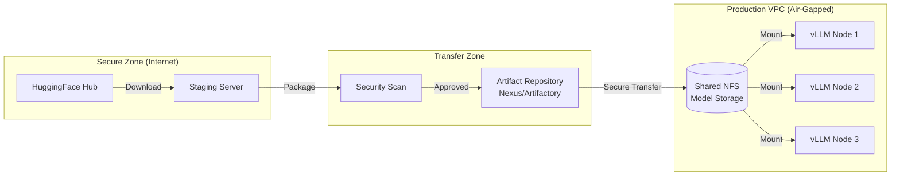
```mermaid
graph LR
    subgraph "Secure Zone (Internet)"
        HF[HuggingFace Hub]
        STAGING[Staging Server]
    end
    
    subgraph "Transfer Zone"
        SCAN[Security Scan]
        ARTIFACT[Artifact Repository<br/>Nexus/Artifactory]
    end
    
    subgraph "Production VPC (Air-Gapped)"
        NFS[(Shared NFS<br/>Model Storage)]
        VLLM1[vLLM Node 1]
        VLLM2[vLLM Node 2]
        VLLM3[vLLM Node 3]
    end
    
    HF -->|Download| STAGING
    STAGING -->|Package| SCAN
    SCAN -->|Approved| ARTIFACT
    ARTIFACT -->|Secure Transfer| NFS
    NFS -->|Mount| VLLM1
    NFS -->|Mount| VLLM2
    NFS -->|Mount| VLLM3
```

##### Model Deployment Options

```
┌─────────────────────────────────────────────────────────────────────────┐
│                MODEL DEPLOYMENT TO PRODUCTION                           │
├─────────────────────────────────────────────────────────────────────────┤
│                                                                         │
│  OPTION 1: Shared NFS Storage (Recommended)                            │
│  ──────────────────────────────────────────                            │
│  • Models stored on central NFS/CIFS share                             │
│  • All vLLM nodes mount the same storage                               │
│  • Update model once → all nodes see it                                │
│  • Easy rollback (just change symlink)                                 │
│                                                                         │
│  /models/                                                               │
│  ├── llama-3-70b-v1/           # Version 1                             │
│  ├── llama-3-70b-v2/           # Version 2                             │
│  ├── llama-3-70b-v3/           # Version 3 (latest)                    │
│  └── current -> llama-3-70b-v3 # Symlink to active version             │
│                                                                         │
│  OPTION 2: Container Image with Model                                  │
│  ─────────────────────────────────────                                 │
│  • Model baked into Docker image                                       │
│  • Larger images (~150GB) but immutable                                │
│  • Deploy via Kubernetes rolling update                                │
│                                                                         │
│  OPTION 3: S3/Object Storage (if available)                            │
│  ─────────────────────────────────────────                             │
│  • Models in MinIO/S3 bucket                                           │
│  • vLLM downloads on startup                                           │
│  • Good for cloud-native environments                                  │
│                                                                         │
└─────────────────────────────────────────────────────────────────────────┘
```

##### Model Update Process (Zero Downtime)

```mermaid
sequenceDiagram
    autonumber
    participant Ops as ML Ops Team
    participant Staging as Staging Env
    participant Artifact as Artifact Repo
    participant NFS as Shared Storage
    participant LB as Load Balancer
    participant V1 as vLLM Node 1
    participant V2 as vLLM Node 2
    participant V3 as vLLM Node 3
    
    Note over Ops,V3: PHASE 1: Model Preparation
    Ops->>Staging: Download new model version
    Staging->>Staging: Run validation tests
    Staging->>Staging: Security scan
    Staging->>Artifact: Push to artifact repo
    Artifact->>NFS: Transfer to prod storage
    
    Note over Ops,V3: PHASE 2: Rolling Update
    Ops->>LB: Remove Node 1 from rotation
    LB-->>V1: Stop sending traffic
    Ops->>V1: Restart with new model
    V1->>NFS: Load new model version
    V1-->>Ops: Ready
    Ops->>LB: Add Node 1 back
    
    Ops->>LB: Remove Node 2 from rotation
    LB-->>V2: Stop sending traffic
    Ops->>V2: Restart with new model
    V2->>NFS: Load new model version
    V2-->>Ops: Ready
    Ops->>LB: Add Node 2 back
    
    Ops->>LB: Remove Node 3 from rotation
    Ops->>V3: Restart with new model
    V3-->>Ops: Ready
    Ops->>LB: Add Node 3 back
    
    Note over Ops,V3: ✅ Zero downtime achieved
```

##### Model Version Management

```yaml
# model-registry.yaml - Track all model versions
models:
  llama-3-70b:
    current_version: v3
    versions:
      v1:
        path: /models/llama-3-70b-v1
        deployed: 2026-01-15
        status: archived
        sha256: abc123...
        
      v2:
        path: /models/llama-3-70b-v2
        deployed: 2026-03-01
        status: rollback_ready
        sha256: def456...
        
      v3:
        path: /models/llama-3-70b-v3
        deployed: 2026-04-01
        status: active
        sha256: ghi789...
        changelog: |
          - Improved loan terminology understanding
          - Better compliance response accuracy
          - Fine-tuned on banking domain data
        
    rollback_policy:
      keep_versions: 3
      auto_rollback_on_error_rate: 5%  # If >5% errors, auto-rollback
```

##### Automated Model Update Pipeline

```
┌─────────────────────────────────────────────────────────────────────────┐
│                    MODEL UPDATE CI/CD PIPELINE                          │
├─────────────────────────────────────────────────────────────────────────┤
│                                                                         │
│  ┌──────────┐    ┌──────────┐    ┌──────────┐    ┌──────────┐         │
│  │  MODEL   │───▶│ VALIDATE │───▶│ SECURITY │───▶│  STAGE   │         │
│  │ DOWNLOAD │    │  & TEST  │    │   SCAN   │    │  DEPLOY  │         │
│  └──────────┘    └──────────┘    └──────────┘    └──────────┘         │
│       │               │               │               │                │
│       ▼               ▼               ▼               ▼                │
│  Download from   Run eval suite   Scan for        Deploy to           │
│  HuggingFace     - Accuracy       vulnerabilities staging cluster     │
│  or internal     - Latency        - Model weights                      │
│  registry        - Memory usage   - Dependencies                       │
│                                                                         │
│  ┌──────────┐    ┌──────────┐    ┌──────────┐    ┌──────────┐         │
│  │  CANARY  │───▶│ MONITOR  │───▶│  ROLLOUT │───▶│ COMPLETE │         │
│  │  DEPLOY  │    │  & EVAL  │    │   100%   │    │          │         │
│  └──────────┘    └──────────┘    └──────────┘    └──────────┘         │
│       │               │               │               │                │
│       ▼               ▼               ▼               ▼                │
│  Deploy to 1     Monitor for      If OK, roll     Update model        │
│  prod node       - Error rate     out to all      registry, archive   │
│  (10% traffic)   - Latency        nodes           old version         │
│                  - Quality                                             │
│                                                                         │
│  ┌─────────────────────────────────────────────────────────────────┐   │
│  │  ROLLBACK TRIGGER                                                │   │
│  │  • Error rate > 5%                                               │   │
│  │  • Latency p99 > 10s                                            │   │
│  │  • Quality score drop > 10%                                      │   │
│  │  → Automatic rollback to previous version                       │   │
│  └─────────────────────────────────────────────────────────────────┘   │
│                                                                         │
└─────────────────────────────────────────────────────────────────────────┘
```

##### Kubernetes Deployment with Model Updates

```yaml
# vllm-deployment.yaml
apiVersion: apps/v1
kind: Deployment
metadata:
  name: vllm-llama3
  annotations:
    model-version: "v3"  # Track model version
spec:
  replicas: 3
  strategy:
    type: RollingUpdate
    rollingUpdate:
      maxUnavailable: 1  # Only 1 node down at a time
      maxSurge: 0
  template:
    spec:
      containers:
      - name: vllm
        image: vllm/vllm-openai:v0.4.0
        env:
        - name: MODEL_VERSION
          value: "v3"
        args:
          - --model=/models/current  # Symlink to active version
          - --tensor-parallel-size=4
        volumeMounts:
        - name: model-storage
          mountPath: /models
          readOnly: true
        readinessProbe:
          httpGet:
            path: /health
            port: 8000
          initialDelaySeconds: 120  # Model load time
          periodSeconds: 10
      volumes:
      - name: model-storage
        nfs:
          server: nfs.bank.internal
          path: /llm-models
---
# Model update script (run by CI/CD)
# update-model.sh
#!/bin/bash
MODEL_VERSION=$1

# 1. Update symlink on NFS
ssh nfs-admin@nfs.bank.internal \
  "ln -sfn /models/llama-3-70b-${MODEL_VERSION} /models/current"

# 2. Rolling restart of vLLM pods
kubectl rollout restart deployment/vllm-llama3

# 3. Wait for rollout
kubectl rollout status deployment/vllm-llama3 --timeout=600s

# 4. Verify
kubectl exec deploy/vllm-llama3 -- \
  curl -s localhost:8000/v1/models | jq .
```

##### A/B Testing New Models

```mermaid
graph TB
    subgraph "A/B Testing New Model"
        LB[Load Balancer<br/>Traffic Split]
        
        subgraph "Model A (Current - 90%)"
            VA1[vLLM Node A1<br/>Llama 3 70B v2]
            VA2[vLLM Node A2<br/>Llama 3 70B v2]
        end
        
        subgraph "Model B (Candidate - 10%)"
            VB1[vLLM Node B1<br/>Llama 3 70B v3]
        end
        
        METRICS[Metrics Collector<br/>Compare A vs B]
    end
    
    LB -->|90%| VA1
    LB -->|90%| VA2
    LB -->|10%| VB1
    
    VA1 --> METRICS
    VA2 --> METRICS
    VB1 --> METRICS
```

##### Model Update Checklist

```
┌─────────────────────────────────────────────────────────────────────────┐
│                    MODEL UPDATE CHECKLIST                               │
├─────────────────────────────────────────────────────────────────────────┤
│                                                                         │
│  PRE-UPDATE                                                             │
│  □ New model downloaded and verified (checksum)                        │
│  □ Security scan completed                                             │
│  □ Evaluation tests passed on staging                                  │
│  □ Memory requirements verified (fits in GPU)                          │
│  □ Rollback version identified and ready                               │
│  □ Maintenance window scheduled (if needed)                            │
│  □ On-call team notified                                               │
│                                                                         │
│  DURING UPDATE                                                          │
│  □ Copy model to shared storage                                        │
│  □ Update symlink/registry                                             │
│  □ Rolling restart nodes one at a time                                 │
│  □ Monitor error rates and latency                                     │
│  □ Verify each node healthy before proceeding                          │
│                                                                         │
│  POST-UPDATE                                                            │
│  □ All nodes running new version                                       │
│  □ Error rate within acceptable range (<1%)                            │
│  □ Latency within SLA                                                  │
│  □ Sample responses reviewed for quality                               │
│  □ Update model registry documentation                                 │
│  □ Archive old version (keep for rollback)                             │
│  □ Delete versions older than retention policy                         │
│                                                                         │
└─────────────────────────────────────────────────────────────────────────┘
```

##### Scheduled Model Refresh Strategy

```java
// Model refresh configuration
@Configuration
public class ModelRefreshConfig {
    
    // Periodic model evaluation
    @Scheduled(cron = "0 0 2 * * MON")  // Every Monday 2 AM
    public void evaluateModelPerformance() {
        ModelMetrics metrics = metricsCollector.getLast7Days();
        
        if (metrics.getAccuracyScore() < 0.95 ||
            metrics.getAvgLatency() > Duration.ofSeconds(5)) {
            
            alertService.notify(
                "Model performance degraded - consider update",
                metrics
            );
        }
    }
    
    // Check for new model versions
    @Scheduled(cron = "0 0 3 1 * ?")  // 1st of each month
    public void checkForModelUpdates() {
        ModelVersion latest = modelRegistry.getLatestAvailable("llama-3-70b");
        ModelVersion current = modelRegistry.getCurrentDeployed("llama-3-70b");
        
        if (latest.isNewerThan(current)) {
            // Trigger staging deployment for evaluation
            cicdPipeline.triggerModelEvaluation(latest);
        }
    }
}
```

#### Implementation: LLM Abstraction Layer

```java
// Abstract LLM interface - supports multiple backends
public interface LlmRuntime {
    ChatResponse chat(ChatRequest request);
    EmbeddingResponse embed(EmbeddingRequest request);
    boolean isHealthy();
}

// Ollama implementation (Development)
@Profile("dev")
@Service
public class OllamaRuntime implements LlmRuntime {
    private final OllamaClient client;
    
    @Override
    public ChatResponse chat(ChatRequest request) {
        return client.chat(request);
    }
}

// vLLM implementation (Production)
@Profile("prod")
@Service
public class VllmRuntime implements LlmRuntime {
    private final WebClient vllmClient;
    private final LoadBalancer loadBalancer;
    private final CircuitBreaker circuitBreaker;
    
    @Override
    public ChatResponse chat(ChatRequest request) {
        String endpoint = loadBalancer.nextEndpoint();
        return circuitBreaker.run(() -> 
            vllmClient.post()
                .uri(endpoint + "/v1/chat/completions")
                .bodyValue(toOpenAiFormat(request))
                .retrieve()
                .bodyToMono(ChatResponse.class)
                .block()
        );
    }
}

// LangChain4j Configuration
@Configuration
public class LlmConfig {
    
    @Bean
    @Profile("dev")
    public ChatLanguageModel ollamaModel() {
        return OllamaChatModel.builder()
            .baseUrl("http://localhost:11434")
            .modelName("llama3:70b")
            .build();
    }
    
    @Bean
    @Profile("prod")
    public ChatLanguageModel vllmModel(
            @Value("${vllm.endpoints}") List<String> endpoints) {
        return OpenAiChatModel.builder()
            .baseUrl(endpoints.get(0))  // With load balancer
            .apiKey("not-needed")        // vLLM doesn't require key
            .modelName("meta-llama/Llama-3-70B-Instruct")
            .build();
    }
}
```

#### Production Deployment Architecture

```mermaid
graph TB
    subgraph "Bank VPC - Production"
        subgraph "Application Tier"
            ATA1[ATA Instance 1]
            ATA2[ATA Instance 2]
            ATA3[ATA Instance N]
        end
        
        subgraph "LLM Gateway"
            KONG[Kong / Envoy<br/>Rate Limiting<br/>Circuit Breaker]
        end
        
        subgraph "vLLM Cluster (GPU Nodes)"
            subgraph "Primary"
                VLLM_P1[vLLM Primary 1<br/>Llama 3 70B<br/>4x A100 80GB]
                VLLM_P2[vLLM Primary 2<br/>Llama 3 70B<br/>4x A100 80GB]
            end
            
            subgraph "Fallback"
                VLLM_F1[vLLM Fallback<br/>Llama 3 8B<br/>1x A100 40GB]
            end
        end
        
        subgraph "Monitoring"
            PROM[Prometheus]
            GRAF[Grafana]
            ALERT[AlertManager]
        end
    end
    
    ATA1 --> KONG
    ATA2 --> KONG
    ATA3 --> KONG
    
    KONG -->|Primary| VLLM_P1
    KONG -->|Primary| VLLM_P2
    KONG -->|Fallback| VLLM_F1
    
    VLLM_P1 --> PROM
    VLLM_P2 --> PROM
    VLLM_F1 --> PROM
    PROM --> GRAF
    PROM --> ALERT
```

#### Configuration by Environment

```yaml
# application-dev.yml
spring:
  profiles: dev
  
llm:
  runtime: ollama
  ollama:
    base-url: http://localhost:11434
    model: llama3:8b
    timeout: 120s

---
# application-prod.yml  
spring:
  profiles: prod

llm:
  runtime: vllm
  vllm:
    endpoints:
      - http://vllm-primary-1:8000
      - http://vllm-primary-2:8000
    fallback-endpoints:
      - http://vllm-fallback:8000
    model: meta-llama/Llama-3-70B-Instruct
    timeout: 30s
    max-tokens: 4096
    
  load-balancer:
    strategy: round-robin
    health-check-interval: 10s
    
  circuit-breaker:
    failure-threshold: 5
    recovery-timeout: 30s
    
  rate-limit:
    requests-per-second: 100
    burst: 150
```

#### Kubernetes Deployment (vLLM)

```yaml
# vllm-deployment.yaml
apiVersion: apps/v1
kind: Deployment
metadata:
  name: vllm-llama3-70b
spec:
  replicas: 2
  selector:
    matchLabels:
      app: vllm
  template:
    metadata:
      labels:
        app: vllm
    spec:
      containers:
      - name: vllm
        image: vllm/vllm-openai:latest
        args:
          - --model=meta-llama/Llama-3-70B-Instruct
          - --tensor-parallel-size=4
          - --max-model-len=8192
          - --gpu-memory-utilization=0.9
        resources:
          limits:
            nvidia.com/gpu: 4
            memory: 320Gi
          requests:
            nvidia.com/gpu: 4
            memory: 320Gi
        ports:
        - containerPort: 8000
        readinessProbe:
          httpGet:
            path: /health
            port: 8000
          initialDelaySeconds: 60
          periodSeconds: 10
        livenessProbe:
          httpGet:
            path: /health
            port: 8000
          initialDelaySeconds: 120
          periodSeconds: 30
      nodeSelector:
        gpu-type: a100-80gb
---
apiVersion: v1
kind: Service
metadata:
  name: vllm-service
spec:
  selector:
    app: vllm
  ports:
  - port: 8000
    targetPort: 8000
  type: ClusterIP
```

#### Fallback Strategy

```
┌─────────────────────────────────────────────────────────────────────────┐
│                    LLM FALLBACK STRATEGY                                │
├─────────────────────────────────────────────────────────────────────────┤
│                                                                         │
│  PRIMARY (Llama 3 70B)                                                  │
│  ├── Best quality responses                                            │
│  ├── Higher latency (~2-5s)                                            │
│  └── Used for: Complex loan decisions                                  │
│                                                                         │
│  FALLBACK (Llama 3 8B)                                                  │
│  ├── Triggered when: Primary circuit breaker opens                     │
│  ├── Lower latency (~0.5-1s)                                           │
│  ├── Acceptable quality for most cases                                 │
│  └── Used for: Simple queries, degraded mode                           │
│                                                                         │
│  GRACEFUL DEGRADATION                                                   │
│  ├── If all LLMs down: Queue requests                                  │
│  ├── Alert operations team                                             │
│  └── Return "decision pending manual review"                           │
│                                                                         │
└─────────────────────────────────────────────────────────────────────────┘
```

### SDK Dependencies

```xml
<!-- pom.xml dependencies -->
<dependencies>
    <!-- MCP SDK for Model Context Protocol -->
    <dependency>
        <groupId>io.modelcontextprotocol</groupId>
        <artifactId>mcp-sdk</artifactId>
        <version>1.0.0</version>
    </dependency>
    
    <!-- A2A SDK for Agent-to-Agent Protocol -->
    <dependency>
        <groupId>com.google.a2a</groupId>
        <artifactId>a2a-sdk</artifactId>
        <version>1.0.0</version>
    </dependency>
    
    <!-- LangChain4j for Agent Framework -->
    <dependency>
        <groupId>dev.langchain4j</groupId>
        <artifactId>langchain4j</artifactId>
        <version>0.35.0</version>
    </dependency>
    
    <!-- LangChain4j Ollama Integration -->
    <dependency>
        <groupId>dev.langchain4j</groupId>
        <artifactId>langchain4j-ollama</artifactId>
        <version>0.35.0</version>
    </dependency>
    
    <!-- JVector for Embeddings -->
    <dependency>
        <groupId>io.github.jbellis</groupId>
        <artifactId>jvector</artifactId>
        <version>3.0.0</version>
    </dependency>
    
    <!-- Spring Boot -->
    <dependency>
        <groupId>org.springframework.boot</groupId>
        <artifactId>spring-boot-starter-web</artifactId>
        <version>3.3.0</version>
    </dependency>
</dependencies>
```

## Appendix B: Non-Functional Requirements

| Requirement | Target | Implementation |
|-------------|--------|----------------|
| **Latency** | < 5s for decision | Caching, connection pooling, optimized prompts |
| **Throughput** | 500+ concurrent requests | Virtual Threads, horizontal scaling |
| **Availability** | 99.9% uptime | Multi-instance deployment, health checks |
| **Audit Retention** | 7 years | PostgreSQL with archival strategy |
| **Encryption** | AES-256 at rest, TLS 1.3 in transit | Spring Security, PostgreSQL encryption |

## Appendix D: Infrastructure Cost Estimates

### Cost Summary

```
┌─────────────────────────────────────────────────────────────────────────┐
│                    TOTAL COST ESTIMATE (ANNUAL)                         │
├─────────────────────────────────────────────────────────────────────────┤
│                                                                         │
│  OPTION A: ON-PREMISE (CapEx + OpEx)                                   │
│  ────────────────────────────────────                                  │
│  Year 1 (Hardware + Setup):     $850,000 - $1,200,000                 │
│  Year 2+ (Operations only):     $150,000 - $250,000/year              │
│                                                                         │
│  OPTION B: CLOUD (AWS/Azure/GCP)                                       │
│  ───────────────────────────────                                       │
│  Monthly Cost:                  $80,000 - $150,000/month               │
│  Annual Cost:                   $960,000 - $1,800,000/year             │
│                                                                         │
│  OPTION C: HYBRID (Recommended for Banks)                              │
│  ────────────────────────────────────────                              │
│  On-Prem GPU + Cloud App:       $600,000 - $900,000/year              │
│                                                                         │
└─────────────────────────────────────────────────────────────────────────┘
```

### Detailed Cost Breakdown

#### 1. GPU Infrastructure (vLLM Cluster)

| Component | Specs | Quantity | Unit Cost | Total |
|-----------|-------|----------|-----------|-------|
| **GPU Server (Primary)** | Dell PowerEdge R750xa, 4x A100 80GB, 512GB RAM, 2TB NVMe | 2 | $250,000 | $500,000 |
| **GPU Server (Fallback)** | Dell PowerEdge R750xa, 2x A100 40GB, 256GB RAM, 1TB NVMe | 1 | $120,000 | $120,000 |
| **NVLink Interconnect** | High-speed GPU-to-GPU | Included | - | - |
| **Rack & Power** | 42U rack, PDUs, UPS | 1 | $15,000 | $15,000 |
| | | | **Subtotal** | **$635,000** |

#### 2. Application Infrastructure (ATA Cluster)

| Component | Specs | Quantity | Unit Cost | Total |
|-----------|-------|----------|-----------|-------|
| **App Server** | Dell R650, 32 cores, 128GB RAM, 1TB SSD | 3 | $15,000 | $45,000 |
| **Load Balancer** | F5 / HAProxy Enterprise | 2 (HA) | $10,000 | $20,000 |
| **API Gateway** | Kong Enterprise | 1 | $15,000/yr | $15,000 |
| | | | **Subtotal** | **$80,000** |

#### 3. Data Infrastructure

| Component | Specs | Quantity | Unit Cost | Total |
|-----------|-------|----------|-----------|-------|
| **PostgreSQL Server** | Primary: 64 cores, 256GB RAM, 4TB NVMe | 1 | $25,000 | $25,000 |
| **PostgreSQL Replica** | Standby: Same specs | 1 | $25,000 | $25,000 |
| **NFS Storage** | NetApp / Dell EMC, 20TB usable | 1 | $40,000 | $40,000 |
| **Backup Storage** | 100TB cold storage | 1 | $20,000 | $20,000 |
| | | | **Subtotal** | **$110,000** |

#### 4. Network & Security

| Component | Specs | Quantity | Unit Cost | Total |
|-----------|-------|----------|-----------|-------|
| **Firewall** | Palo Alto / Fortinet | 2 (HA) | $15,000 | $30,000 |
| **Network Switches** | 100Gbps spine/leaf | 4 | $8,000 | $32,000 |
| **SSL Certificates** | Enterprise wildcard | 1 | $2,000/yr | $2,000 |
| | | | **Subtotal** | **$64,000** |

#### 5. Software Licenses

| Software | Type | Annual Cost |
|----------|------|-------------|
| **RHEL / Ubuntu Pro** | OS Support | $10,000 |
| **PostgreSQL Enterprise** | Database Support | $15,000 |
| **Kong Enterprise** | API Gateway | $15,000 |
| **Monitoring (Datadog/Splunk)** | Observability | $25,000 |
| **Kubernetes (OpenShift)** | Container Platform | $50,000 |
| | **Subtotal** | **$115,000/year** |

#### 6. Personnel Costs

| Role | FTE | Annual Salary | Total |
|------|-----|---------------|-------|
| **ML Engineer** | 1 | $180,000 | $180,000 |
| **DevOps/SRE** | 1 | $160,000 | $160,000 |
| **Platform Engineer** | 0.5 | $150,000 | $75,000 |
| | | **Subtotal** | **$415,000/year** |

### Total Cost Summary (On-Premise)

```
┌─────────────────────────────────────────────────────────────────────────┐
│                    ON-PREMISE COST BREAKDOWN                            │
├─────────────────────────────────────────────────────────────────────────┤
│                                                                         │
│  CAPITAL EXPENDITURE (Year 1 Only)                                     │
│  ─────────────────────────────────                                     │
│  GPU Infrastructure:            $635,000                               │
│  Application Servers:            $80,000                               │
│  Data Infrastructure:           $110,000                               │
│  Network & Security:             $64,000                               │
│  ─────────────────────────────────────────                             │
│  TOTAL CAPEX:                   $889,000                               │
│                                                                         │
│  OPERATIONAL EXPENDITURE (Annual)                                      │
│  ────────────────────────────────                                      │
│  Software Licenses:             $115,000                               │
│  Personnel (ML + DevOps):       $415,000                               │
│  Power & Cooling:                $36,000  (est. 30kW @ $0.10/kWh)     │
│  Maintenance & Support:          $50,000                               │
│  ─────────────────────────────────────────                             │
│  TOTAL OPEX:                    $616,000/year                          │
│                                                                         │
│  ═══════════════════════════════════════════════════════════════════   │
│  YEAR 1 TOTAL:                $1,505,000                               │
│  YEAR 2+ TOTAL:                 $616,000/year                          │
│  ═══════════════════════════════════════════════════════════════════   │
│                                                                         │
│  3-YEAR TCO:                  $2,737,000                               │
│  5-YEAR TCO:                  $3,969,000                               │
│                                                                         │
└─────────────────────────────────────────────────────────────────────────┘
```

### Cloud Cost Comparison (AWS/Azure)

### Cloud Provider Comparison (AWS vs Azure vs GCP)

#### Service Mapping

| Component | AWS | Azure | GCP | On-Premise |
|-----------|-----|-------|-----|------------|
| **GPU Compute** | EC2 P4d/P5 | NC A100 v4 | A2 Ultra | Dell R750xa + A100 |
| **App Compute** | EC2 M6i | D-series v5 | N2 | Dell R650 |
| **Kubernetes** | EKS | AKS | GKE | OpenShift |
| **Database** | RDS PostgreSQL | Azure PostgreSQL | Cloud SQL | PostgreSQL |
| **Object Storage** | S3 | Blob Storage | Cloud Storage | NetApp/EMC |
| **File Storage** | EFS | Azure Files | Filestore | NFS |
| **Load Balancer** | ALB/NLB | Azure LB | Cloud LB | F5/HAProxy |
| **API Gateway** | API Gateway | API Management | Apigee | Kong |
| **VPC/Network** | VPC | VNet | VPC | Physical |
| **Secrets** | Secrets Manager | Key Vault | Secret Manager | HashiCorp Vault |
| **Monitoring** | CloudWatch | Monitor | Cloud Monitoring | Prometheus/Grafana |
| **Container Registry** | ECR | ACR | Artifact Registry | Harbor |

#### Detailed Cloud Cost Comparison

```
┌─────────────────────────────────────────────────────────────────────────────────────────┐
│                         CLOUD PROVIDER COST COMPARISON                                   │
├─────────────────────────────────────────────────────────────────────────────────────────┤
│                                                                                         │
│  Component              │  AWS                  │  Azure                │  GCP          │
│  ───────────────────────┼───────────────────────┼───────────────────────┼───────────────│
│                         │                       │                       │               │
│  GPU INSTANCES (Monthly)│                       │                       │               │
│  ───────────────────────┼───────────────────────┼───────────────────────┼───────────────│
│  8x A100 40GB           │ p4d.24xlarge          │ NC96ads_A100_v4       │ a2-ultragpu-8g│
│  (Primary vLLM)         │ $32.77/hr             │ $32.77/hr             │ $29.39/hr     │
│                         │ = $23,922/mo          │ = $23,922/mo          │ = $21,455/mo  │
│  ×2 nodes               │ = $47,844/mo          │ = $47,844/mo          │ = $42,910/mo  │
│                         │                       │                       │               │
│  4x A100 40GB           │ p4d.24xlarge (½)      │ NC48ads_A100_v4       │ a2-ultragpu-4g│
│  (Fallback vLLM)        │ Use smaller           │ $16.39/hr             │ $14.69/hr     │
│                         │ = $11,961/mo          │ = $11,961/mo          │ = $10,723/mo  │
│                         │                       │                       │               │
│  ───────────────────────┼───────────────────────┼───────────────────────┼───────────────│
│  APP INSTANCES          │                       │                       │               │
│  ───────────────────────┼───────────────────────┼───────────────────────┼───────────────│
│  16 vCPU, 64GB RAM      │ m6i.4xlarge           │ D16s_v5               │ n2-standard-16│
│  (ATA Nodes ×3)         │ $0.768/hr × 3         │ $0.768/hr × 3         │ $0.778/hr × 3 │
│                         │ = $1,682/mo           │ = $1,682/mo           │ = $1,704/mo   │
│                         │                       │                       │               │
│  ───────────────────────┼───────────────────────┼───────────────────────┼───────────────│
│  KUBERNETES             │                       │                       │               │
│  ───────────────────────┼───────────────────────┼───────────────────────┼───────────────│
│  Managed K8s            │ EKS                   │ AKS                   │ GKE           │
│  Control Plane          │ $0.10/hr = $73/mo     │ FREE                  │ FREE (Std)    │
│                         │                       │                       │ $73/mo (Auto) │
│                         │                       │                       │               │
│  ───────────────────────┼───────────────────────┼───────────────────────┼───────────────│
│  DATABASE               │                       │                       │               │
│  ───────────────────────┼───────────────────────┼───────────────────────┼───────────────│
│  PostgreSQL             │ RDS db.r6g.2xlarge    │ Azure PostgreSQL      │ Cloud SQL     │
│  8 vCPU, 64GB           │ $0.52/hr              │ GP_Gen5_8             │ db-custom-8   │
│  + 2TB storage          │ = $380/mo             │ $0.56/hr = $410/mo    │ $0.48/hr      │
│  + backup               │ + $160 storage        │ + $230 storage        │ = $350/mo     │
│                         │ = $540/mo             │ = $640/mo             │ + $200 storage│
│                         │                       │                       │ = $550/mo     │
│                         │                       │                       │               │
│  ───────────────────────┼───────────────────────┼───────────────────────┼───────────────│
│  STORAGE                │                       │                       │               │
│  ───────────────────────┼───────────────────────┼───────────────────────┼───────────────│
│  File Storage (500GB)   │ EFS                   │ Azure Files           │ Filestore     │
│  (Model storage)        │ $0.30/GB = $150/mo    │ $0.24/GB = $120/mo    │ $0.20/GB      │
│                         │                       │                       │ = $100/mo     │
│                         │                       │                       │               │
│  Object Storage (1TB)   │ S3                    │ Blob Storage          │ Cloud Storage │
│  (Backups)              │ $0.023/GB = $23/mo    │ $0.018/GB = $18/mo    │ $0.020/GB     │
│                         │                       │                       │ = $20/mo      │
│                         │                       │                       │               │
│  ───────────────────────┼───────────────────────┼───────────────────────┼───────────────│
│  NETWORKING             │                       │                       │               │
│  ───────────────────────┼───────────────────────┼───────────────────────┼───────────────│
│  Load Balancer          │ ALB                   │ Azure LB              │ Cloud LB      │
│                         │ $0.0225/hr + LCU      │ $0.025/hr + rules     │ $0.025/hr     │
│                         │ = $50/mo              │ = $40/mo              │ = $45/mo      │
│                         │                       │                       │               │
│  NAT Gateway            │ $0.045/hr + data      │ $0.045/hr + data      │ $0.044/hr     │
│                         │ = $100/mo             │ = $100/mo             │ = $95/mo      │
│                         │                       │                       │               │
│  Private Link/Endpoint  │ $0.01/hr × 5          │ $0.01/hr × 5          │ FREE          │
│                         │ = $37/mo              │ = $37/mo              │               │
│                         │                       │                       │               │
│  ───────────────────────┼───────────────────────┼───────────────────────┼───────────────│
│  SECURITY               │                       │                       │               │
│  ───────────────────────┼───────────────────────┼───────────────────────┼───────────────│
│  Secrets Manager        │ $0.40/secret/mo       │ Key Vault             │ Secret Manager│
│  (20 secrets)           │ = $8/mo               │ $0.03/10k ops         │ $0.06/10k     │
│                         │                       │ = $5/mo               │ = $3/mo       │
│                         │                       │                       │               │
│  WAF                    │ $5/mo + $1/rule       │ $5/mo + $1/rule       │ Cloud Armor   │
│                         │ = $20/mo              │ = $20/mo              │ = $25/mo      │
│                         │                       │                       │               │
│  ───────────────────────┼───────────────────────┼───────────────────────┼───────────────│
│  MONITORING             │                       │                       │               │
│  ───────────────────────┼───────────────────────┼───────────────────────┼───────────────│
│  Logs & Metrics         │ CloudWatch            │ Monitor               │ Cloud Monitor │
│                         │ = $500/mo             │ = $400/mo             │ = $450/mo     │
│                         │                       │                       │               │
│  ═══════════════════════╪═══════════════════════╪═══════════════════════╪═══════════════│
│  MONTHLY TOTAL          │ ~$63,000/mo           │ ~$62,000/mo           │ ~$57,000/mo   │
│  (On-Demand)            │                       │                       │               │
│  ═══════════════════════╪═══════════════════════╪═══════════════════════╪═══════════════│
│  ANNUAL TOTAL           │ ~$756,000/yr          │ ~$744,000/yr          │ ~$684,000/yr  │
│  (On-Demand)            │                       │                       │               │
│  ═══════════════════════╪═══════════════════════╪═══════════════════════╪═══════════════│
│  WITH RESERVED (1yr)    │ ~$530,000/yr          │ ~$520,000/yr          │ ~$480,000/yr  │
│  (30% discount)         │                       │                       │               │
│  ═══════════════════════╪═══════════════════════╪═══════════════════════╪═══════════════│
│  WITH RESERVED (3yr)    │ ~$420,000/yr          │ ~$410,000/yr          │ ~$380,000/yr  │
│  (45% discount)         │                       │                       │               │
│                         │                       │                       │               │
└─────────────────────────────────────────────────────────────────────────────────────────┘
```

#### Cloud vs On-Premise TCO (5 Years)

| Metric | On-Premise | AWS | Azure | GCP |
|--------|------------|-----|-------|-----|
| **Year 1** | $1,505,000 | $756,000 | $744,000 | $684,000 |
| **Year 2** | $616,000 | $530,000¹ | $520,000¹ | $480,000¹ |
| **Year 3** | $616,000 | $530,000 | $520,000 | $480,000 |
| **Year 4** | $616,000 | $530,000 | $520,000 | $480,000 |
| **Year 5** | $616,000 | $530,000 | $520,000 | $480,000 |
| **5-Year TCO** | **$3,969,000** | **$2,876,000** | **$2,824,000** | **$2,604,000** |
| **Hardware Refresh** | +$635,000 (Yr 4) | Included | Included | Included |
| **Adjusted 5-Year** | **$4,604,000** | **$2,876,000** | **$2,824,000** | **$2,604,000** |

¹ With 1-year reserved instances

### Cloud Feasibility Analysis for Banking

```
┌─────────────────────────────────────────────────────────────────────────────────────────┐
│                    IS CLOUD FEASIBLE FOR THIS APPLICATION?                               │
├─────────────────────────────────────────────────────────────────────────────────────────┤
│                                                                                         │
│  SHORT ANSWER: YES, but with significant conditions                                    │
│                                                                                         │
│  ✅ CLOUD IS FEASIBLE IF:                                                              │
│  ────────────────────────                                                              │
│  1. Bank has approved cloud providers (most large banks have)                          │
│  2. Using Private/Isolated offerings:                                                  │
│     • AWS: Dedicated Hosts + PrivateLink + VPC                                        │
│     • Azure: Dedicated Hosts + Private Link + Confidential Computing                  │
│     • GCP: Sole-Tenant Nodes + Private Google Access                                  │
│  3. Data residency requirements can be met (regional availability)                    │
│  4. Compliance frameworks are satisfied (SOC2, ISO27001, PCI-DSS)                     │
│                                                                                         │
│  ❌ CLOUD MAY NOT BE FEASIBLE IF:                                                      │
│  ─────────────────────────────────                                                     │
│  1. Strict air-gap requirements (no internet at all)                                  │
│  2. Regulatory prohibition on cloud for AI workloads                                  │
│  3. Data sovereignty laws prohibit specific cloud regions                             │
│  4. Internal policy mandates on-premise for LLMs                                      │
│                                                                                         │
└─────────────────────────────────────────────────────────────────────────────────────────┘
```

#### Cloud Security Options for Banking

| Security Feature | AWS | Azure | GCP |
|------------------|-----|-------|-----|
| **Dedicated Hardware** | Dedicated Hosts | Dedicated Hosts | Sole-Tenant Nodes |
| **Private Networking** | PrivateLink | Private Link | Private Google Access |
| **Encryption (Rest)** | KMS + HSM | Key Vault + HSM | Cloud KMS + HSM |
| **Encryption (Transit)** | TLS 1.3 | TLS 1.3 | TLS 1.3 |
| **Confidential Compute** | Nitro Enclaves | Confidential VMs | Confidential VMs |
| **Compliance** | SOC, ISO, PCI, FedRAMP | SOC, ISO, PCI, FedRAMP | SOC, ISO, PCI, FedRAMP |
| **Data Residency** | Regional | Regional | Regional |
| **Audit Logging** | CloudTrail | Activity Log | Audit Logs |
| **BYOK** | ✅ Yes | ✅ Yes | ✅ Yes |

#### Regulatory Compliance Matrix

| Regulation | Cloud Feasibility | Notes |
|------------|-------------------|-------|
| **EU AI Act** | ✅ Feasible | Requires audit trail (ATA provides this) |
| **GDPR** | ✅ Feasible | EU regions available on all clouds |
| **PCI-DSS** | ✅ Feasible | All major clouds are PCI compliant |
| **SOX** | ✅ Feasible | Audit controls available |
| **Basel III/IV** | ⚠️ Depends | Some banks require on-premise for AI |
| **Local Banking Regs** | ⚠️ Varies | Check country-specific requirements |
| **FFIEC (US)** | ✅ Feasible | Cloud guidance available |
| **MAS (Singapore)** | ✅ Feasible | Cloud-friendly with conditions |
| **PRA/FCA (UK)** | ✅ Feasible | Material outsourcing rules apply |

#### Cloud Architecture for Banking (Secure Configuration)

```mermaid
graph TB
    subgraph "Bank Corporate Network"
        USERS[Bank Users]
        VPN[VPN Gateway]
    end
    
    subgraph "Cloud Provider (AWS/Azure/GCP)"
        subgraph "Isolated VPC/VNet"
            subgraph "Private Subnet (No Internet)"
                subgraph "Confidential Computing"
                    VLLM[vLLM on Dedicated Hosts<br/>Encrypted Memory]
                end
                
                subgraph "Application Tier"
                    ATA[ATA Instances<br/>Private IP Only]
                end
                
                subgraph "Data Tier"
                    DB[(PostgreSQL<br/>Encrypted + BYOK)]
                    STORAGE[(Model Storage<br/>Encrypted)]
                end
            end
            
            PLINK[Private Link /<br/>PrivateLink]
        end
        
        HSM[Cloud HSM<br/>Key Management]
    end
    
    USERS --> VPN
    VPN -->|Direct Connect /<br/>ExpressRoute| PLINK
    PLINK --> ATA
    ATA --> VLLM
    ATA --> DB
    VLLM --> STORAGE
    ATA --> HSM
```

#### Recommendation Matrix

```
┌─────────────────────────────────────────────────────────────────────────────────────────┐
│                    DEPLOYMENT RECOMMENDATION BY SCENARIO                                │
├─────────────────────────────────────────────────────────────────────────────────────────┤
│                                                                                         │
│  SCENARIO                           │ RECOMMENDATION      │ RATIONALE                  │
│  ───────────────────────────────────┼─────────────────────┼────────────────────────────│
│                                     │                     │                            │
│  Large bank with existing           │ ☁️ CLOUD            │ Lower TCO, existing        │
│  cloud presence & approval          │ (AWS/Azure/GCP)     │ compliance framework       │
│                                     │                     │                            │
│  Bank with strict air-gap           │ 🏢 ON-PREMISE       │ No cloud option available  │
│  requirements                       │                     │                            │
│                                     │                     │                            │
│  Regional bank, budget              │ ☁️ GCP CLOUD        │ Best price/performance,    │
│  conscious                          │ (with CUD)          │ lower GPU costs            │
│                                     │                     │                            │
│  Investment bank with               │ 🔀 HYBRID           │ LLM on-prem for speed,     │
│  latency requirements               │                     │ app tier in cloud          │
│                                     │                     │                            │
│  Multi-region global bank           │ ☁️ MULTI-CLOUD      │ Regional compliance,       │
│                                     │                     │ disaster recovery          │
│                                     │                     │                            │
│  Startup/Fintech                    │ ☁️ CLOUD            │ No CapEx, fast deployment, │
│                                     │                     │ scale as needed            │
│                                     │                     │                            │
│  Central bank / Government          │ 🏢 ON-PREMISE       │ Sovereignty requirements   │
│                                     │ or Sovereign Cloud  │                            │
│                                     │                     │                            │
└─────────────────────────────────────────────────────────────────────────────────────────┘
```

#### Final Cost Comparison Summary

```
┌─────────────────────────────────────────────────────────────────────────────────────────┐
│                         FINAL COST COMPARISON (5-YEAR TCO)                              │
├─────────────────────────────────────────────────────────────────────────────────────────┤
│                                                                                         │
│                    ON-PREMISE         AWS           AZURE          GCP                 │
│                    ──────────         ───           ─────          ───                 │
│                                                                                         │
│  5-Year Cost       $4,604,000¹       $2,876,000    $2,824,000    $2,604,000           │
│                                                                                         │
│  Pros              • Full control    • Flexible    • Enterprise   • Best GPU           │
│                    • Air-gapped      • Global      • Azure AD     • Lowest cost        │
│                    • No data leaves  • Mature      • Hybrid       • AI/ML focus        │
│                                                                                         │
│  Cons              • High CapEx      • Complex     • Complex      • Fewer regions      │
│                    • HW refresh      • Data egress • Licensing    • Less enterprise    │
│                    • Maintenance     • Vendor lock • Cost creep   • Vendor lock        │
│                                                                                         │
│  Best For          Air-gapped,       Global,       Microsoft      Cost-conscious,      │
│                    sovereign         startup,      shops,         AI-first             │
│                                      flexible      hybrid                              │
│                                                                                         │
│  ¹ Includes hardware refresh in Year 4                                                 │
│                                                                                         │
│  ═══════════════════════════════════════════════════════════════════════════════════   │
│  RECOMMENDATION: For most banks, CLOUD (GCP or Azure) is feasible and cost-effective │
│                  if security/compliance requirements can be met with private offerings │
│  ═══════════════════════════════════════════════════════════════════════════════════   │
│                                                                                         │
└─────────────────────────────────────────────────────────────────────────────────────────┘
```

```
┌─────────────────────────────────────────────────────────────────────────┐
│                    CLOUD COST ESTIMATES (AWS)                           │
├─────────────────────────────────────────────────────────────────────────┤
│                                                                         │
│  GPU INSTANCES (vLLM)                                                  │
│  ────────────────────                                                  │
│  p4d.24xlarge (8x A100 40GB)    $32.77/hr × 2 × 730hrs = $47,843/mo   │
│  OR                                                                     │
│  p5.48xlarge (8x H100 80GB)     $98.32/hr × 1 × 730hrs = $71,773/mo   │
│                                                                         │
│  APPLICATION INSTANCES                                                  │
│  ─────────────────────                                                 │
│  m6i.4xlarge (16 vCPU, 64GB)    $0.768/hr × 3 × 730hrs = $1,682/mo    │
│                                                                         │
│  DATABASE                                                               │
│  ────────                                                              │
│  RDS PostgreSQL db.r6g.2xlarge  $0.52/hr × 730hrs = $380/mo           │
│  + Storage (2TB gp3)            $0.08/GB × 2000GB = $160/mo            │
│                                                                         │
│  STORAGE & NETWORKING                                                   │
│  ────────────────────                                                  │
│  EFS (Model Storage 500GB)      $0.30/GB × 500GB = $150/mo            │
│  Data Transfer (internal)       ~$500/mo                               │
│  NAT Gateway                    ~$300/mo                               │
│                                                                         │
│  ─────────────────────────────────────────────────────────────────────  │
│  MONTHLY TOTAL (Estimated):     $95,000 - $130,000/month              │
│  ANNUAL TOTAL:                  $1,140,000 - $1,560,000/year          │
│  ─────────────────────────────────────────────────────────────────────  │
│                                                                         │
│  Note: Reserved instances can reduce costs by 30-40%                   │
│  With 1-year RI: ~$800,000 - $1,100,000/year                          │
│                                                                         │
└─────────────────────────────────────────────────────────────────────────┘
```

### Cost Optimization Strategies

```
┌─────────────────────────────────────────────────────────────────────────┐
│                    COST OPTIMIZATION OPTIONS                            │
├─────────────────────────────────────────────────────────────────────────┤
│                                                                         │
│  1. USE SMALLER MODEL (Llama 3 8B instead of 70B)                      │
│     ─────────────────────────────────────────────                      │
│     GPU Requirement: 1x A100 40GB (vs 4x A100 80GB)                    │
│     Cost Reduction: ~70% on GPU infrastructure                         │
│     Trade-off: Lower quality responses                                 │
│                                                                         │
│  2. QUANTIZATION (INT8/INT4)                                           │
│     ──────────────────────────                                         │
│     Run 70B model on 2x A100 instead of 4x                            │
│     Cost Reduction: ~50% on GPU infrastructure                         │
│     Trade-off: Minor quality degradation (usually acceptable)          │
│                                                                         │
│  3. SPOT/PREEMPTIBLE INSTANCES (Cloud)                                 │
│     ──────────────────────────────────                                 │
│     Use for non-critical workloads                                     │
│     Cost Reduction: 60-70% on compute                                  │
│     Trade-off: Instances can be terminated                             │
│                                                                         │
│  4. RIGHT-SIZING                                                        │
│     ────────────                                                       │
│     Start with smaller cluster, scale based on demand                  │
│     Use auto-scaling in cloud                                          │
│                                                                         │
│  5. HYBRID APPROACH                                                     │
│     ────────────────                                                   │
│     GPU on-premise (fixed cost)                                        │
│     App tier in cloud (flexible scaling)                               │
│                                                                         │
└─────────────────────────────────────────────────────────────────────────┘
```

### Configuration Options by Budget

| Budget | Configuration | Throughput | Quality |
|--------|---------------|------------|---------|
| **$500K/year** | 2x A100 40GB, Llama 3 8B, quantized | ~200 req/s | Good |
| **$1M/year** | 4x A100 80GB, Llama 3 70B, 2 nodes | ~400 req/s | Excellent |
| **$1.5M/year** | 8x A100 80GB, Llama 3 70B, 3 nodes + HA | ~600 req/s | Excellent + HA |
| **$2M+/year** | H100 cluster, multiple models, full redundancy | ~1000+ req/s | Best |

### Development Environment Cost

```
┌─────────────────────────────────────────────────────────────────────────┐
│                    DEVELOPMENT ENVIRONMENT                              │
├─────────────────────────────────────────────────────────────────────────┤
│                                                                         │
│  OPTION A: Local Development (Per Developer)                           │
│  ──────────────────────────────────────────                            │
│  MacBook Pro M3 Max (96GB):           $4,000 (one-time)               │
│  Ollama + Llama 3 8B:                 FREE                             │
│  Local PostgreSQL:                     FREE                             │
│  Total:                               $4,000 per developer             │
│                                                                         │
│  OPTION B: Shared Dev GPU Server                                       │
│  ────────────────────────────────                                      │
│  Server with 2x RTX 4090 (48GB):      $15,000 (one-time)              │
│  Shared by 5-10 developers                                             │
│  Supports Llama 3 70B (quantized)                                      │
│  Total:                               $1,500 - $3,000 per developer    │
│                                                                         │
│  OPTION C: Cloud Dev Environment                                       │
│  ───────────────────────────────                                       │
│  AWS g5.2xlarge (1x A10G 24GB):       $1.21/hr                        │
│  8 hours/day × 22 days/month:         $213/month per developer        │
│  Total:                               $2,556/year per developer        │
│                                                                         │
└─────────────────────────────────────────────────────────────────────────┘
```

### ROI Considerations

```
┌─────────────────────────────────────────────────────────────────────────┐
│                    ROI ANALYSIS                                         │
├─────────────────────────────────────────────────────────────────────────┤
│                                                                         │
│  CURRENT STATE (Manual Loan Processing)                                │
│  ─────────────────────────────────────                                 │
│  • Average underwriter salary: $85,000/year                            │
│  • Loans processed per underwriter: ~500/year                          │
│  • Cost per loan decision: $170                                        │
│  • 10 underwriters processing 5,000 loans/year = $850,000/year        │
│                                                                         │
│  WITH ATA (AI-Assisted Processing)                                     │
│  ─────────────────────────────────                                     │
│  • ATA handles 80% of routine decisions automatically                  │
│  • 2 underwriters for complex cases + oversight = $170,000/year       │
│  • ATA infrastructure: $616,000/year (after Year 1)                   │
│  • Total: $786,000/year                                                │
│                                                                         │
│  SAVINGS                                                                │
│  ───────                                                               │
│  • Year 1: -$655,000 (investment year)                                │
│  • Year 2+: +$64,000/year savings                                     │
│  • Break-even: ~Year 2                                                 │
│  • 5-Year ROI: +$191,000                                              │
│                                                                         │
│  NON-FINANCIAL BENEFITS                                                │
│  ──────────────────────                                                │
│  • 24/7 availability (vs business hours)                              │
│  • Consistent decisions (no human variance)                            │
│  • 100% audit trail (regulatory compliance)                           │
│  • Faster processing (seconds vs hours)                               │
│  • Scalability (handle volume spikes)                                 │
│                                                                         │
└─────────────────────────────────────────────────────────────────────────┘
```

## Appendix C: Agent vs Workflow Comparison

## Appendix E: Security Architecture

### Security Overview by Layer

```
┌─────────────────────────────────────────────────────────────────────────────────────────┐
│                         SECURITY ARCHITECTURE OVERVIEW                                   │
├─────────────────────────────────────────────────────────────────────────────────────────┤
│                                                                                         │
│  ┌─────────────────────────────────────────────────────────────────────────────────┐   │
│  │ LAYER 1: CLIENT LAYER                                                            │   │
│  │ • OAuth 2.0 / OpenID Connect    • MFA Enforcement    • Session Management       │   │
│  └─────────────────────────────────────────────────────────────────────────────────┘   │
│                                          │                                              │
│                                          ▼                                              │
│  ┌─────────────────────────────────────────────────────────────────────────────────┐   │
│  │ LAYER 2: NETWORK LAYER                                                           │   │
│  │ • WAF (OWASP Top 10)    • DDoS Protection    • TLS 1.3    • IP Allowlisting     │   │
│  └─────────────────────────────────────────────────────────────────────────────────┘   │
│                                          │                                              │
│                                          ▼                                              │
│  ┌─────────────────────────────────────────────────────────────────────────────────┐   │
│  │ LAYER 3: APPLICATION LAYER                                                       │   │
│  │ • Input Validation    • Rate Limiting    • RBAC    • API Security              │   │
│  └─────────────────────────────────────────────────────────────────────────────────┘   │
│                                          │                                              │
│                                          ▼                                              │
│  ┌─────────────────────────────────────────────────────────────────────────────────┐   │
│  │ LAYER 4: AGENT CORE                                                              │   │
│  │ • Tool Authorization    • Prompt Injection Defense    • Audit Logging          │   │
│  └─────────────────────────────────────────────────────────────────────────────────┘   │
│                                          │                                              │
│                                          ▼                                              │
│  ┌─────────────────────────────────────────────────────────────────────────────────┐   │
│  │ LAYER 5: AI LAYER                                                                │   │
│  │ • Model Isolation    • Output Filtering    • Guardrails    • No External Calls │   │
│  └─────────────────────────────────────────────────────────────────────────────────┘   │
│                                          │                                              │
│                                          ▼                                              │
│  ┌─────────────────────────────────────────────────────────────────────────────────┐   │
│  │ LAYER 6: DATA LAYER                                                              │   │
│  │ • Encryption at Rest (AES-256)    • BYOK    • Access Control    • Data Masking │   │
│  └─────────────────────────────────────────────────────────────────────────────────┘   │
│                                          │                                              │
│                                          ▼                                              │
│  ┌─────────────────────────────────────────────────────────────────────────────────┐   │
│  │ LAYER 7: INTEGRATION LAYER (MCP/A2A)                                             │   │
│  │ • mTLS    • Agent Authentication    • Capability-Based Access    • Signed Msgs │   │
│  └─────────────────────────────────────────────────────────────────────────────────┘   │
│                                                                                         │
└─────────────────────────────────────────────────────────────────────────────────────────┘
```

### Layer 1: Client Layer Security

```mermaid
graph TB
    subgraph "Client Layer Security"
        subgraph "Authentication"
            OAUTH[OAuth 2.0 / OIDC]
            MFA[Multi-Factor Auth]
            SSO[Enterprise SSO<br/>SAML / Active Directory]
            CERT[Client Certificates<br/>mTLS for Services]
        end
        
        subgraph "Session Management"
            JWT[JWT Tokens<br/>Short-lived: 15min]
            REFRESH[Refresh Tokens<br/>Secure, Rotated]
            REVOKE[Token Revocation<br/>Immediate Invalidation]
        end
        
        subgraph "Client Controls"
            DEVICE[Device Registration]
            GEO[Geo-Restrictions]
            TIME[Time-Based Access]
        end
    end
```

| Component | Security Control | Implementation |
|-----------|-----------------|----------------|
| **User Authentication** | OAuth 2.0 + OIDC | Keycloak / Azure AD / Okta |
| **Service Authentication** | mTLS | Client certificates for service-to-service |
| **MFA** | TOTP / Push / Hardware Key | Required for all users |
| **Session Tokens** | JWT with short expiry | 15-minute access, 8-hour refresh |
| **Token Storage** | Secure HTTP-only cookies | No localStorage for tokens |
| **Session Fixation** | New token on auth | Regenerate session ID post-login |
| **Concurrent Sessions** | Limited to 3 | Force logout oldest session |

```java
// Spring Security Configuration
@Configuration
@EnableWebSecurity
public class SecurityConfig {
    
    @Bean
    public SecurityFilterChain filterChain(HttpSecurity http) throws Exception {
        http
            .oauth2ResourceServer(oauth2 -> oauth2
                .jwt(jwt -> jwt.jwtAuthenticationConverter(jwtConverter()))
            )
            .sessionManagement(session -> session
                .sessionCreationPolicy(SessionCreationPolicy.STATELESS)
                .maximumSessions(3)
            )
            .headers(headers -> headers
                .contentSecurityPolicy(csp -> csp.policyDirectives(
                    "default-src 'self'; frame-ancestors 'none'"))
                .frameOptions(frame -> frame.deny())
                .xssProtection(xss -> xss.block(true))
            )
            .csrf(csrf -> csrf.csrfTokenRepository(
                CookieCsrfTokenRepository.withHttpOnlyFalse()))
            .authorizeHttpRequests(auth -> auth
                .requestMatchers("/api/loans/**").hasRole("UNDERWRITER")
                .requestMatchers("/api/audit/**").hasRole("COMPLIANCE_OFFICER")
                .requestMatchers("/api/admin/**").hasRole("ADMIN")
                .anyRequest().authenticated()
            );
        return http.build();
    }
}
```

### Layer 2: Network Layer Security

```mermaid
graph TB
    subgraph "Network Security Architecture"
        INTERNET((Internet))
        
        subgraph "Perimeter Security"
            WAF[Web Application Firewall<br/>OWASP Top 10 Protection]
            DDOS[DDoS Protection<br/>Rate Limiting]
            GEO[Geo-Blocking<br/>Country Restrictions]
        end
        
        subgraph "DMZ"
            LB[Load Balancer<br/>TLS Termination]
            IDS[IDS/IPS<br/>Intrusion Detection]
        end
        
        subgraph "Application Zone"
            FW1[Internal Firewall]
            APP[Application Servers]
        end
        
        subgraph "AI Zone"
            FW2[AI Zone Firewall]
            LLM[vLLM Servers]
        end
        
        subgraph "Data Zone"
            FW3[Data Zone Firewall]
            DB[(Database)]
        end
    end
    
    INTERNET --> WAF
    WAF --> DDOS
    DDOS --> GEO
    GEO --> LB
    LB --> IDS
    IDS --> FW1
    FW1 --> APP
    APP --> FW2
    FW2 --> LLM
    APP --> FW3
    FW3 --> DB
```

| Component | Security Control | Configuration |
|-----------|-----------------|---------------|
| **WAF** | OWASP Top 10 | SQL injection, XSS, CSRF protection |
| **DDoS Protection** | Rate limiting | 1000 req/min per IP |
| **TLS** | Version 1.3 only | Strong cipher suites only |
| **Certificate** | EV SSL | Auto-renewal, pinning optional |
| **Firewall Rules** | Deny by default | Explicit allow rules only |
| **Network Segmentation** | Zone-based | App → AI → Data isolation |
| **Internal Traffic** | mTLS | All service-to-service encrypted |
| **DNS** | Private DNS | No public resolution for internal |

```yaml
# Network Security Rules
firewall_rules:
  perimeter:
    - name: allow-https
      source: internet
      destination: dmz
      port: 443
      action: allow
      
    - name: deny-all-other
      source: internet
      destination: any
      action: deny
      
  internal:
    - name: app-to-ai
      source: application-zone
      destination: ai-zone
      port: 8000
      protocol: tcp
      action: allow
      
    - name: app-to-db
      source: application-zone
      destination: data-zone
      port: 5432
      protocol: tcp
      action: allow
      
    - name: deny-ai-to-internet
      source: ai-zone
      destination: internet
      action: deny  # LLM cannot reach internet
```

### Layer 3: Application Layer Security

```mermaid
graph TB
    subgraph "Application Security"
        subgraph "Input Security"
            VALID[Input Validation<br/>Schema-based]
            SANITIZE[Input Sanitization<br/>Escape Special Chars]
            SIZE[Size Limits<br/>Max Request Size]
        end
        
        subgraph "Access Control"
            RBAC[Role-Based Access<br/>Underwriter, Compliance, Admin]
            ABAC[Attribute-Based<br/>Department, Region]
            ROW[Row-Level Security<br/>Own Applications Only]
        end
        
        subgraph "Rate Limiting"
            GLOBAL[Global Rate Limit<br/>10k req/min]
            USER[Per-User Limit<br/>100 req/min]
            ENDPOINT[Per-Endpoint<br/>Varies by operation]
        end
        
        subgraph "API Security"
            VERSIONING[API Versioning]
            DEPRECATION[Deprecation Policy]
            SCHEMA[OpenAPI Schema<br/>Strict Validation]
        end
    end
```

| Component | Security Control | Implementation |
|-----------|-----------------|----------------|
| **Input Validation** | JSON Schema validation | Every request validated |
| **SQL Injection** | Parameterized queries | JPA/Hibernate |
| **XSS Prevention** | Output encoding | HTML entity encoding |
| **CORS** | Strict origin policy | Allowlist only |
| **Rate Limiting** | Token bucket | Resilience4j |
| **RBAC** | Role hierarchy | Spring Security |
| **Data Filtering** | Field-level security | @JsonView annotations |
| **Error Handling** | Generic errors | No stack traces exposed |

```java
// Input Validation
@RestController
@Validated
public class LoanController {
    
    @PostMapping("/api/loans/evaluate")
    public LoanDecision evaluate(
            @Valid @RequestBody LoanRequest request,
            @AuthenticationPrincipal JwtUser user) {
        
        // Row-level security: user can only access their department's loans
        if (!user.getDepartment().equals(request.getDepartment())) {
            throw new AccessDeniedException("Cross-department access denied");
        }
        
        return loanService.evaluate(request);
    }
}

// Request validation
public record LoanRequest(
    @NotNull @Pattern(regexp = "^[A-Z0-9]{10}$") 
    String customerId,
    
    @NotNull @DecimalMin("1000") @DecimalMax("10000000") 
    BigDecimal amount,
    
    @NotBlank @Size(max = 500) 
    String purpose,
    
    @NotNull 
    LoanType loanType
) {}

// Rate limiting
@RateLimiter(name = "loanEvaluation", fallbackMethod = "rateLimitFallback")
public LoanDecision evaluate(LoanRequest request) {
    // ...
}
```

### Layer 4: Agent Core Security

```mermaid
graph TB
    subgraph "Agent Core Security"
        subgraph "Tool Security"
            REGISTRY[Tool Registry<br/>Allowlist Only]
            AUTH_TOOL[Tool Authorization<br/>Per-Role Permissions]
            SANDBOX[Execution Sandbox<br/>Resource Limits]
        end
        
        subgraph "Prompt Security"
            INJECT[Prompt Injection Defense<br/>Input Sanitization]
            TEMPLATE[Prompt Templates<br/>No User-Controlled Prompts]
            BOUNDARY[Clear Boundaries<br/>System vs User Messages]
        end
        
        subgraph "Audit & Monitoring"
            LOG_ALL[Log All Actions<br/>Before Execution]
            IMMUTABLE[Immutable Audit Trail<br/>No Deletion Allowed]
            ALERT[Anomaly Detection<br/>Unusual Patterns]
        end
        
        subgraph "Output Security"
            FILTER[Output Filtering<br/>PII Detection]
            VALIDATE[Response Validation<br/>Schema Enforcement]
            REDACT[Sensitive Data Redaction]
        end
    end
```

| Component | Security Control | Implementation |
|-----------|-----------------|----------------|
| **Tool Allowlist** | Explicit registration | Only approved tools callable |
| **Tool Authorization** | Per-role permissions | Underwriter can't call admin tools |
| **Prompt Injection** | Input sanitization | Strip control characters |
| **Prompt Templates** | Parameterized prompts | No direct user prompt injection |
| **Resource Limits** | Timeout & memory | Max 30s per tool call |
| **Audit Logging** | Pre-execution logging | Log before tool executes |
| **Output Filtering** | PII detection | Mask SSN, account numbers |
| **Hallucination Prevention** | Tool verification | Cross-check LLM claims |

```java
// Tool Security Implementation
@Service
public class SecureToolRegistry {
    
    private final Map<String, ToolDefinition> allowedTools = Map.of(
        "getCreditScore", new ToolDefinition(
            "getCreditScore",
            Set.of(Role.UNDERWRITER, Role.SENIOR_UNDERWRITER),
            new ResourceLimits(Duration.ofSeconds(5), 100_000) // 5s timeout, 100KB response
        ),
        "checkPolicyCompliance", new ToolDefinition(
            "checkPolicyCompliance",
            Set.of(Role.UNDERWRITER, Role.COMPLIANCE_OFFICER),
            new ResourceLimits(Duration.ofSeconds(10), 500_000)
        )
    );
    
    @PreAuthorize("hasAnyRole(@toolRegistry.getRolesForTool(#toolName))")
    public Object invokeTool(String toolName, Object[] args, User user) {
        
        // 1. Verify tool is in allowlist
        if (!allowedTools.containsKey(toolName)) {
            auditService.logBlockedToolCall(toolName, user, "NOT_IN_ALLOWLIST");
            throw new SecurityException("Tool not allowed: " + toolName);
        }
        
        // 2. Log BEFORE execution (immutable audit)
        String auditId = auditService.logToolCallStart(toolName, args, user);
        
        // 3. Execute with resource limits
        try {
            Object result = executeWithLimits(toolName, args, 
                allowedTools.get(toolName).limits());
            
            // 4. Filter sensitive data from response
            Object filteredResult = sensitiveDataFilter.filter(result);
            
            // 5. Log completion
            auditService.logToolCallComplete(auditId, filteredResult);
            
            return filteredResult;
        } catch (Exception e) {
            auditService.logToolCallError(auditId, e);
            throw e;
        }
    }
}

// Prompt Injection Defense
@Component
public class PromptSecurityFilter {
    
    private static final Pattern INJECTION_PATTERNS = Pattern.compile(
        "(?i)(ignore previous|disregard|forget|new instructions|system prompt|" +
        "you are now|act as|pretend to be|\\[\\[|\\]\\]|<\\|im_start\\|>)"
    );
    
    public String sanitizeUserInput(String input) {
        // 1. Check for injection patterns
        if (INJECTION_PATTERNS.matcher(input).find()) {
            auditService.logSecurityEvent("PROMPT_INJECTION_ATTEMPT", input);
            throw new SecurityException("Potentially malicious input detected");
        }
        
        // 2. Remove control characters
        String sanitized = input.replaceAll("[\\x00-\\x1F\\x7F]", "");
        
        // 3. Limit length
        if (sanitized.length() > 10000) {
            sanitized = sanitized.substring(0, 10000);
        }
        
        // 4. Escape special prompt characters
        sanitized = sanitized.replace("```", "'''");
        
        return sanitized;
    }
}
```

### Layer 5: AI Layer Security

```mermaid
graph TB
    subgraph "AI Layer Security"
        subgraph "Model Security"
            ISOLATION[Process Isolation<br/>Separate Container]
            NO_INTERNET[No Internet Access<br/>Air-Gapped]
            READONLY[Read-Only Model<br/>No Fine-Tuning in Prod]
        end
        
        subgraph "Inference Security"
            TIMEOUT[Inference Timeout<br/>Max 60 seconds]
            MEMORY[Memory Limits<br/>Prevent OOM]
            QUEUE[Request Queue<br/>Bounded Size]
        end
        
        subgraph "Output Guardrails"
            CONTENT[Content Filtering<br/>No Harmful Content]
            FORMAT[Format Validation<br/>Expected JSON Schema]
            CONFIDENCE[Confidence Thresholds<br/>Low = Human Review]
        end
        
        subgraph "Model Integrity"
            CHECKSUM[Model Checksum<br/>SHA-256 Verification]
            VERSION[Version Tracking<br/>Immutable History]
            SCAN[Pre-Deploy Scan<br/>Backdoor Detection]
        end
    end
```

| Component | Security Control | Implementation |
|-----------|-----------------|----------------|
| **Model Isolation** | Container/VM isolation | vLLM in dedicated container |
| **Network Isolation** | No internet access | No egress allowed |
| **Model Integrity** | SHA-256 checksum | Verified on every load |
| **Inference Timeout** | 60s max | Kill long-running inference |
| **Output Validation** | JSON schema | Reject malformed responses |
| **Content Filtering** | Guardrails | Block harmful content |
| **Confidence Scoring** | Threshold alerts | Low confidence → human review |
| **Model Updates** | Staged rollout | Canary deployment |

```java
// AI Layer Security Configuration
@Configuration
public class AiSecurityConfig {
    
    @Bean
    public GuardrailsFilter guardrailsFilter() {
        return GuardrailsFilter.builder()
            .addContentFilter(new ProfanityFilter())
            .addContentFilter(new HarmfulContentFilter())
            .addContentFilter(new PiiOutputFilter())
            .addSchemaValidator(LoanDecisionSchema.class)
            .confidenceThreshold(0.7)  // Below this → human review
            .build();
    }
    
    @Bean
    public ModelIntegrityChecker integrityChecker() {
        return new ModelIntegrityChecker(
            "/models/current",
            "sha256:abc123..."  // Expected checksum
        );
    }
}

// vLLM container security (docker-compose)
/*
services:
  vllm:
    image: vllm/vllm-openai:latest
    security_opt:
      - no-new-privileges:true
    cap_drop:
      - ALL
    read_only: true
    networks:
      - ai-internal  # No internet access
    deploy:
      resources:
        limits:
          memory: 320G
        reservations:
          devices:
            - capabilities: [gpu]
    volumes:
      - type: bind
        source: /models
        target: /models
        read_only: true
*/
```

### Layer 6: Data Layer Security

```mermaid
graph TB
    subgraph "Data Layer Security"
        subgraph "Encryption"
            REST[Encryption at Rest<br/>AES-256-GCM]
            TRANSIT[Encryption in Transit<br/>TLS 1.3]
            FIELD[Field-Level Encryption<br/>Sensitive Fields]
        end
        
        subgraph "Key Management"
            HSM[Hardware Security Module<br/>FIPS 140-2 Level 3]
            BYOK[Bring Your Own Key<br/>Customer Controlled]
            ROTATION[Key Rotation<br/>Annual or On-Demand]
        end
        
        subgraph "Access Control"
            RBAC_DB[Database RBAC<br/>Least Privilege]
            ROW_SEC[Row-Level Security<br/>Department Isolation]
            COLUMN[Column-Level Access<br/>Hide Sensitive]
        end
        
        subgraph "Data Protection"
            MASK[Dynamic Data Masking<br/>SSN, Account Numbers]
            TOKENIZE[Tokenization<br/>PCI Data]
            AUDIT_DB[Database Audit<br/>All Access Logged]
        end
    end
```

| Component | Security Control | Implementation |
|-----------|-----------------|----------------|
| **Encryption at Rest** | AES-256-GCM | PostgreSQL TDE / pgcrypto |
| **Encryption in Transit** | TLS 1.3 | Required for all connections |
| **Key Management** | HSM | AWS CloudHSM / Azure HSM |
| **BYOK** | Customer keys | Key never leaves HSM |
| **Key Rotation** | Annual | Automated rotation |
| **Row-Level Security** | PostgreSQL RLS | Department-based isolation |
| **Column Encryption** | pgcrypto | SSN, account numbers |
| **Data Masking** | Dynamic masking | Based on user role |
| **Audit Logging** | pgAudit | All DML/DDL logged |
| **Backup Encryption** | AES-256 | Encrypted backups |

```sql
-- PostgreSQL Security Configuration

-- 1. Enable TLS
-- postgresql.conf
ssl = on
ssl_cert_file = '/certs/server.crt'
ssl_key_file = '/certs/server.key'
ssl_min_protocol_version = 'TLSv1.3'

-- 2. Row-Level Security
ALTER TABLE loan_application ENABLE ROW LEVEL SECURITY;

CREATE POLICY department_isolation ON loan_application
    FOR ALL
    USING (department_id = current_setting('app.department_id')::uuid);

-- 3. Field-Level Encryption
CREATE EXTENSION IF NOT EXISTS pgcrypto;

-- Encrypt sensitive fields
CREATE OR REPLACE FUNCTION encrypt_ssn(ssn TEXT) 
RETURNS BYTEA AS $$
BEGIN
    RETURN pgp_sym_encrypt(ssn, current_setting('app.encryption_key'));
END;
$$ LANGUAGE plpgsql SECURITY DEFINER;

-- 4. Dynamic Data Masking
CREATE OR REPLACE VIEW loan_application_masked AS
SELECT 
    application_id,
    customer_id,
    CASE 
        WHEN current_user IN ('compliance_officer', 'admin') 
        THEN customer_ssn
        ELSE 'XXX-XX-' || RIGHT(customer_ssn, 4)
    END AS customer_ssn,
    amount,
    status
FROM loan_application;

-- 5. Audit Logging
CREATE EXTENSION IF NOT EXISTS pgaudit;
-- postgresql.conf: pgaudit.log = 'all'

-- 6. Least Privilege Roles
CREATE ROLE ata_app_read;
CREATE ROLE ata_app_write;
CREATE ROLE ata_compliance_read;

GRANT SELECT ON loan_application_masked TO ata_app_read;
GRANT SELECT, INSERT, UPDATE ON loan_application TO ata_app_write;
GRANT SELECT ON audit_event, reasoning_step, tool_call TO ata_compliance_read;
```

### Layer 7: Integration Layer Security (MCP/A2A)

```mermaid
graph TB
    subgraph "Integration Security (MCP/A2A)"
        subgraph "MCP Security"
            MCP_AUTH[MCP Authentication<br/>OAuth 2.0 / API Key]
            MCP_CAP[Capability-Based Access<br/>Tool-Level Permissions]
            MCP_TLS[Transport Security<br/>mTLS Required]
        end
        
        subgraph "A2A Security"
            A2A_CARD[Agent Card Verification<br/>Signed Identity]
            A2A_AUTH[Agent Authentication<br/>mTLS + JWT]
            A2A_POLICY[Policy Enforcement<br/>What Agents Can Do]
        end
        
        subgraph "Message Security"
            SIGN[Message Signing<br/>Ed25519]
            ENCRYPT[Message Encryption<br/>End-to-End]
            REPLAY[Replay Prevention<br/>Nonce + Timestamp]
        end
        
        subgraph "Trust Boundary"
            ALLOW[Agent Allowlist<br/>Known Partners Only]
            VERIFY[Response Verification<br/>Schema Validation]
            RATE[Inter-Agent Rate Limits]
        end
    end
```

| Component | Security Control | Implementation |
|-----------|-----------------|----------------|
| **MCP Authentication** | OAuth 2.0 + mTLS | Service accounts |
| **MCP Authorization** | Capability-based | Tool-level permissions |
| **A2A Identity** | Agent Cards | Cryptographically signed |
| **A2A Authentication** | mTLS + JWT | Mutual authentication |
| **Message Signing** | Ed25519 | All messages signed |
| **Message Encryption** | AES-256-GCM | E2E encrypted |
| **Replay Prevention** | Nonce + timestamp | 5-minute window |
| **Agent Allowlist** | Explicit trust | Only known agents |
| **Rate Limiting** | Per-agent limits | Prevent DoS |

```java
// MCP Security Configuration
@Configuration
public class McpSecurityConfig {
    
    @Bean
    public McpServer secureMcpServer() {
        return McpServer.builder()
            .authentication(McpAuth.oauth2()
                .tokenEndpoint("https://auth.bank.internal/oauth/token")
                .requiredScopes("mcp:tools:read", "mcp:tools:execute")
                .build())
            .transport(McpTransport.https()
                .mtls(true)
                .clientCertificateRequired(true)
                .trustedCAs("/certs/ca-bundle.pem")
                .build())
            .capabilities(capabilities -> capabilities
                .tool("getCreditScore", ToolCapability.builder()
                    .requiredRole("UNDERWRITER")
                    .rateLimit(100, Duration.ofMinutes(1))
                    .build())
                .tool("getAuditTrail", ToolCapability.builder()
                    .requiredRole("COMPLIANCE_OFFICER")
                    .rateLimit(50, Duration.ofMinutes(1))
                    .build())
            )
            .build();
    }
}

// A2A Security Configuration
@Configuration
public class A2aSecurityConfig {
    
    // Trusted agent allowlist
    private final Set<String> trustedAgents = Set.of(
        "urn:agent:risk-assessment:bank.internal",
        "urn:agent:fraud-detection:bank.internal",
        "urn:agent:compliance:bank.internal"
    );
    
    @Bean
    public A2aClient secureA2aClient() {
        return A2aClient.builder()
            .authentication(A2aAuth.mtls()
                .clientCertificate("/certs/ata-agent.pem")
                .clientKey("/certs/ata-agent-key.pem")
                .trustedCAs("/certs/agent-ca-bundle.pem")
                .build())
            .messageSecurity(MessageSecurity.builder()
                .signing(SigningAlgorithm.ED25519)
                .encryption(EncryptionAlgorithm.AES_256_GCM)
                .replayPrevention(Duration.ofMinutes(5))
                .build())
            .trustPolicy(TrustPolicy.builder()
                .allowedAgents(trustedAgents)
                .verifyAgentCard(true)
                .build())
            .build();
    }
    
    // Verify incoming agent requests
    @Bean
    public A2aSecurityFilter a2aSecurityFilter() {
        return new A2aSecurityFilter() {
            @Override
            public void verify(A2aRequest request) {
                // 1. Verify agent identity
                if (!trustedAgents.contains(request.getAgentId())) {
                    throw new SecurityException("Untrusted agent: " + request.getAgentId());
                }
                
                // 2. Verify agent card signature
                if (!agentCardVerifier.verify(request.getAgentCard())) {
                    throw new SecurityException("Invalid agent card signature");
                }
                
                // 3. Verify message signature
                if (!messageVerifier.verify(request)) {
                    throw new SecurityException("Message signature invalid");
                }
                
                // 4. Check replay
                if (replayChecker.isReplay(request.getNonce(), request.getTimestamp())) {
                    throw new SecurityException("Replay attack detected");
                }
                
                // 5. Log for audit
                auditService.logA2aRequest(request);
            }
        };
    }
}
```

### Security Monitoring & Incident Response

```
┌─────────────────────────────────────────────────────────────────────────────────────────┐
│                    SECURITY MONITORING ARCHITECTURE                                      │
├─────────────────────────────────────────────────────────────────────────────────────────┤
│                                                                                         │
│  ┌─────────────────────────────────────────────────────────────────────────────────┐   │
│  │                           DETECTION LAYER                                        │   │
│  │                                                                                  │   │
│  │  ┌──────────────┐  ┌──────────────┐  ┌──────────────┐  ┌──────────────┐        │   │
│  │  │ WAF Alerts   │  │ Auth Failures│  │ Anomaly Det. │  │ LLM Guardrail│        │   │
│  │  │ • SQL Inj.   │  │ • Brute Force│  │ • Unusual    │  │ • Injection  │        │   │
│  │  │ • XSS        │  │ • Invalid MFA│  │   Patterns   │  │ • Harmful    │        │   │
│  │  │ • DDoS       │  │ • Geo Anomaly│  │ • Volume     │  │   Content    │        │   │
│  │  └──────────────┘  └──────────────┘  └──────────────┘  └──────────────┘        │   │
│  │                                                                                  │   │
│  └─────────────────────────────────────────────────────────────────────────────────┘   │
│                                          │                                              │
│                                          ▼                                              │
│  ┌─────────────────────────────────────────────────────────────────────────────────┐   │
│  │                              SIEM                                                │   │
│  │                     (Splunk / Elastic / Sentinel)                               │   │
│  │  • Correlation Rules  • Threat Intelligence  • Automated Playbooks             │   │
│  └─────────────────────────────────────────────────────────────────────────────────┘   │
│                                          │                                              │
│                                          ▼                                              │
│  ┌─────────────────────────────────────────────────────────────────────────────────┐   │
│  │                         RESPONSE ACTIONS                                         │   │
│  │                                                                                  │   │
│  │  P1 (Critical)     │  P2 (High)         │  P3 (Medium)      │  P4 (Low)        │   │
│  │  • Auto-block IP   │  • Alert SOC       │  • Create ticket  │  • Log only      │   │
│  │  • Kill session    │  • 15-min response │  • 4-hr response  │  • Weekly review │   │
│  │  • Page on-call    │  • Investigate     │  • Review access  │                  │   │
│  │                                                                                  │   │
│  └─────────────────────────────────────────────────────────────────────────────────┘   │
│                                                                                         │
└─────────────────────────────────────────────────────────────────────────────────────────┘
```

### Security Checklist by Component

```
┌─────────────────────────────────────────────────────────────────────────────────────────┐
│                         SECURITY CHECKLIST                                               │
├─────────────────────────────────────────────────────────────────────────────────────────┤
│                                                                                         │
│  CLIENT LAYER                              APPLICATION LAYER                            │
│  □ OAuth 2.0 / OIDC implemented           □ Input validation on all endpoints          │
│  □ MFA enforced for all users             □ Output encoding enabled                    │
│  □ Session timeout configured (15min)      □ Rate limiting configured                  │
│  □ Secure cookie flags set                 □ CORS policy strict                        │
│  □ Client certificate for services         □ Error messages sanitized                  │
│                                                                                         │
│  AGENT CORE                                AI LAYER                                     │
│  □ Tool allowlist enforced                 □ Model isolated (no internet)              │
│  □ Prompt injection filters active         □ Model checksum verified                   │
│  □ Pre-execution audit logging             □ Output guardrails active                  │
│  □ Output PII filtering enabled            □ Inference timeouts set                    │
│  □ Resource limits on tool calls           □ Content filtering enabled                 │
│                                                                                         │
│  DATA LAYER                                INTEGRATION LAYER                            │
│  □ TDE enabled (AES-256)                   □ mTLS for all connections                  │
│  □ TLS 1.3 for connections                 □ Agent allowlist configured                │
│  □ Row-level security enabled              □ Message signing enabled                   │
│  □ Field-level encryption for PII          □ Replay prevention active                  │
│  □ Database audit logging enabled          □ Rate limits per agent                     │
│  □ Backup encryption verified              □ Agent card verification                   │
│                                                                                         │
│  NETWORK LAYER                             MONITORING                                   │
│  □ WAF enabled (OWASP Top 10)              □ SIEM integration complete                 │
│  □ DDoS protection active                  □ Alert thresholds configured               │
│  □ Network segmentation verified           □ Incident response playbooks               │
│  □ No direct internet from AI zone         □ Regular security assessments              │
│  □ Firewall rules audited                  □ Penetration testing scheduled             │
│                                                                                         │
└─────────────────────────────────────────────────────────────────────────────────────────┘
```

## Appendix C: Agent vs Workflow Comparison

### Why ATA is an AI Agent

```mermaid
flowchart TD
    subgraph "Traditional Workflow"
        W1[Receive Application] --> W2[Check Credit Score]
        W2 --> W3[Verify KYC]
        W3 --> W4[Calculate Risk]
        W4 --> W5[Apply Policy Rules]
        W5 --> W6[Generate Decision]
    end
```

```mermaid
flowchart TD
    subgraph "ATA AI Agent - ReAct Pattern"
        A1[Receive Application] --> A2{LLM: What do I need?}
        A2 -->|"Need credit info"| A3[Tool: Get Credit Score]
        A3 --> A4[Observe: Score is 720]
        A4 --> A5{LLM: Is this enough?}
        A5 -->|"Need more context"| A6[Tool: Check Policy]
        A6 --> A7[Observe: Policy requires KYC for >$50k]
        A7 --> A8{LLM: Loan is $100k, need KYC}
        A8 --> A9[Tool: Verify KYC]
        A9 --> A10[Observe: KYC verified]
        A10 --> A11{LLM: Have enough info}
        A11 --> A12[Generate Decision with Reasoning]
    end
```

### Agent Autonomy Spectrum

```
┌────────────────────────────────────────────────────────────────────────────┐
│                          AGENT AUTONOMY SPECTRUM                           │
├────────────────────────────────────────────────────────────────────────────┤
│                                                                            │
│  WORKFLOW          COPILOT           SEMI-AUTONOMOUS        FULLY AUTO    │
│     │                 │                    │                     │        │
│     ▼                 ▼                    ▼                     ▼        │
│  ┌──────┐         ┌──────┐            ┌──────┐              ┌──────┐     │
│  │Fixed │         │Human │            │Agent │              │Agent │     │
│  │Steps │         │Guides│            │Decides│             │Decides│    │
│  │      │         │Agent │            │Human  │             │& Acts │    │
│  │      │         │      │            │Reviews│             │       │    │
│  └──────┘         └──────┘            └──────┘              └──────┘     │
│                                           ▲                              │
│                                           │                              │
│                                        ATA HERE                          │
│                                    (with audit trail)                    │
│                                                                            │
└────────────────────────────────────────────────────────────────────────────┘
```

**ATA Position**: Semi-Autonomous Agent with full auditability
- Agent makes loan decisions autonomously
- All reasoning captured for compliance review
- Critical thresholds can trigger human-in-the-loop

